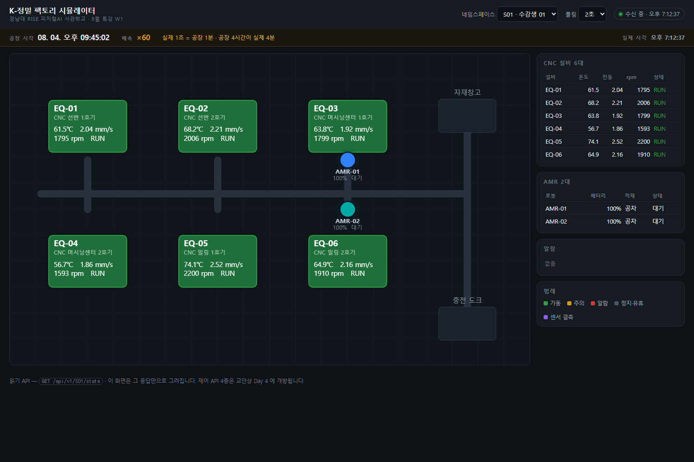

# K-정밀 팩토리 시뮬레이터

경남대 RISE 피지컬AI 사관학교 **8월 Agentic AI 특강** (이틀 × 4시간 · 39명).
학생 39명이 각자 자기 가상 공장 하나를 갖는다.

하드웨어 없이 「인지 → 판단 → 행동 → 다시 인지」 폐루프를 성립시키는 장치다.
**이틀 실습 전체가 이 위에서 돈다.**

```
CNC 설비 6대 (EQ-01~EQ-06)  온도 · 진동 · rpm · 가동상태
AMR 2대 (AMR-01, AMR-02)    위치 · 배터리 · 적재상태
   ↓ 1초 주기 변동 · 배치 적재
Supabase  ← 학생별 네임스페이스로 격리
   ↑
API 서버 (읽기 API + 제어 API 4종 + 강사 콘솔)
   ↑
2D 공장 뷰 (Konva.js)  ·  학생이 만드는 대시보드
```

---

## 빠른 시작

```bash
cp .env.example .env          # 접속 정보를 채운다
uv run tools/migrate.py up    # 스키마 + 테넌트 시드
uv run python -m server.run          # http://localhost:8000
```

상세는 **[배포·기동 절차서](docs/배포_기동_절차서.md)**.

| 주소 | 무엇 |
|---|---|
| `/view` | 2D 공장 뷰 (강사 시연) |
| `/view?tenant=S07` | 특정 학생 공장 |
| `/console` | 강사 콘솔 — 이상 주입 3종, 제어 개방, 초기화 |
| `/docs` | API 문서 (OpenAPI) |
| `/fallback` | 폴백 대시보드 (Supabase 직접 폴링) |



---

## 교안 사양 대응표

교안 3절에 명시된 사양은 하나도 바꾸지 않았다.

| 교안이 정한 것 | 구현 |
|---|---|
| 웹 2D 공장 뷰 + API 서버 | `web/view/` (Konva) + `server/` (FastAPI) |
| CNC 6대 · 온도/진동/rpm/가동상태 | `config/layout.json` · `sim/engine.py` |
| AMR 2대 · 위치/배터리/적재상태 | 경로 그래프 위 좌표 이동 |
| **1초 주기 변동**, Supabase 스트리밍 적재 | `SIM_TICK_SECONDS=1.0` · 2초 배치 `COPY` |
| 제어 API 4종, **3일차에 MCP 도구로 노출** | `api/control.py` · 기본 잠금, 콘솔에서 개방 |
| 강사 콘솔 이상 주입 3종 | `api/instructor.py` · 프리셋 5종 + 배속 |
| 학생별 네임스페이스 분리 | 테넌트 컬럼 · **개인 39개**(팀은 쓰지 않는다) |
| `equipment_id, timestamp, temperature, vibration, rpm, run_state` | `sensor_readings` (+ 격리용 `tenant_id`) · `sensor_readings_csv` 뷰가 6컬럼 그대로 |
| 폴백 경로 | `tools/fallback/state_updater.py` + `web/fallback/` |

리서치가 정한 것(교안 미정 항목): Konva.js 백본 · Supabase Pro 1개 · 테넌트 컬럼 격리 ·
1~2초 폴링(Realtime 아님) · 배치 INSERT.

교안·리서치 어디에도 없어 별도로 설계한 것: **가상 시계(배속)**.
3일차 라이브 시연이 4시간짜리 드리프트를 강의 시간 안에 보여줘야 하는데,
기울기를 키우면 2일차 서사와 모순되기 때문이다(아래 설계 4번).

---

## 완료 기준

| # | 기준 | 상태 | 근거 |
|---|---|---|---|
| ① | 8대 상태 1초 주기 갱신 · Supabase 적재 | 통과 | 312행/초 실측, tick 누락 0 |
| ② | 제어 API 4종 동작 | 통과 | 4종 전부 200 + 감사 로그 |
| ③ | 강사 콘솔 이상 3종 주입 | 통과 | 드리프트·스파이크·결측 실측 · 배속 불변식 회귀검증 |
| ④ | 39명 동시 부하 테스트 | **조건부 통과** | 무료 티어·단일 PC 조건. **Pro 전환 후 강의장 재측정 필요** |
| ⑤ | 네임스페이스 분리 검증 | 통과 | 8개 동시 제어, 교차 오염 0건 (`--tenants 39` 로 실제 수업 조건도 잴 수 있다) |

수치는 **[부하 테스트 결과](docs/부하테스트_결과.md)**.

---

## 검증

```bash
uv run tools/selftest_engine.py    # 엔진 53항목 (DB 불필요, 가상 시계 불변식·주입 만료 포함)
uv run tools/loadtest.py           # 39명 동시 접속
uv run tools/isolation_test.py     # 네임스페이스 분리
uv run tools/check_grants.py       # 공개 키로 쓰기가 막혔는가
```

---

## 설계에서 중요한 네 가지

### 1. 온도는 rpm 의 함수다

```
temp_target = 24℃ + 16.7 × (rpm/1000)^1.4      → 1800rpm 에서 62℃
```

에이전트가 `set_equipment_speed` 로 감속하면 온도가 **실제로 내려간다**(실측 1800rpm 61.6℃ → 900rpm 46.4℃, 60초).
이 결합이 없으면 3일차의 「행동 → 다시 인지」가 닫히지 않는다.

부수 효과로 설비마다 정상 온도가 다르다(EQ-04 56℃ ~ EQ-05 75℃).
2일차 슬라이드의 *"선을 66도로 낮추면 다른 설비들이 하루 종일 울린다"* 가
시뮬레이터 안에서 실제로 성립한다.

### 2. 상태는 서버 메모리, DB 는 적재용

학생 폴링은 DB 를 건드리지 않는다. 그래서 **학생 수가 늘어도 DB 부하가 늘지 않는다**.
Supabase 쓰기는 네임스페이스 수에만 비례한다(39개 = 312행/초 고정).

대가로 **API 서버는 반드시 단일 프로세스**다. `--workers 2` 이상이면 학생마다 다른 공장을 본다.

### 3. 노이즈가 있어야 2일차가 성립한다

정상 구간에 가우시안 노이즈(온도 σ=0.35℃)를 넣었다.
너무 깨끗하면 단순 임계값으로 전부 잡혀 오탐·미탐 학습이 성립하지 않는다.

드리프트 값은 **0.5℃/h · 4시간(62→64℃) 하나뿐**이고 고정 임계값 80℃ 를 넘지 않는다.
2일차 서사("80도를 넘은 적이 없다")와 미탐 학습의 전제라 의도한 것이다.

### 4. 라이브 시연은 기울기가 아니라 시계로 만든다

4시간짜리 드리프트를 강의 시간 안에 보여줘야 하는데, **기울기를 키우면 안 된다.**
샘플당 상승폭이 커져 2일차 논지("사람이 못 알아챌 만큼 미묘하다")와
2일차 학습("이동평균이 적응해 미탐된다")이 동시에 깨진다.

대신 1분 간격 가상 샘플을 그대로 둔 채 그 샘플을 더 빨리 내보낸다.

```
x60 → 실제 1.00초마다 공장 1분치   공장 4시간 = 실제 4분
x80 → 실제 0.75초마다 공장 1분치   공장 4시간 = 실제 3분
```

실측 회귀 결과 기울기 0.5012±0.038℃/h, **샘플당 0.008353℃ — 나눠 주는 7일치 CSV(0.008333)와 동일**.
이상감지 알고리즘 검증 결과가 그대로 유효하다. ×60 은 실제 tick 이 정확히 1초라
교안의 「1초 주기 변동」도 유지된다.

2D 뷰와 콘솔 상단에 **「공장 시각 · 배속」** 이 뜬다 —
강사가 "실제로는 네 시간에 걸친 일"이라고 말할 때 학생이 화면으로 확인할 수 있어야 한다.
**AMR 주행만은 배속과 무관하게 항상 실시간이다**(3일차 클라이맥스가 눈에 보여야 하므로).

---

## 디렉터리

```
config/
  layout.json          공장 배치 · AMR 경로 그래프  ← 좌표의 단일 출처
  sim_profile.json     물리 파라미터 · 이상 기본값 · 가상 시계 · 콘솔 프리셋
db/migrations/          대장에 없는 것만 한 번씩
  001_schema.sql       테이블
  002_views_functions.sql  뷰 · 보존정책 · 초기화 함수
  003_seed_tenants.sql 개인 39 + 팀 8 (팀은 007 이 되돌린다)
  005_virtual_clock.sql  가상 시계 — timestamp(공장 시각) / ingested_at(실제 시각) 분리
  006_maintenance_log.sql 정비 이력
  007_drop_teams.sql   팀 네임스페이스 제거 — 이 특강은 개인 단위다
db/always/              매번 마지막에 다시
  900_grants.sql       공개 키 권한 회수 (건너뛰지 말 것)

> 001~003·005 주석에 `W1`·`Day 4`·팀 편성 같은 **4일 과정 시절 표현**이 남아 있다.
> 이미 적용된 파일이라 고치면 체크섬이 어긋나므로 기록 그대로 둔다.
> **현재 기준은 007 과 이 README 다** — 이 특강은 처음부터 끝까지 개인 단위다.
server/
  run.py               기동 진입점 (workers=1 고정)
  app/
    config.py          환경변수 · 설정 로딩
    db.py              asyncpg — 배치 COPY 적재
    main.py            FastAPI 조립
    sim/
      engine.py        상태 생성기 (물리 · 이상 · 알람)
      graph.py         AMR 경로 (다익스트라)
      runner.py        1초 루프 · 배치 적재 · 보존정책
    api/
      read.py          읽기 API — 2일차부터
      control.py       제어 API 4종 — 3일차에 개방
      instructor.py    강사 콘솔 API
web/
  view/                2D 공장 뷰 (Konva)
  console/             강사 콘솔
  fallback/            폴백 대시보드 (Supabase 직접)
  vendor/konva.min.js  9.3.22 — 강의장 CDN 차단 대비 로컬 벤더링
tools/
  migrate.py           마이그레이션
  selftest_engine.py   엔진 자체 검증 (DB 불필요)
  loadtest.py          39명 동시 접속
  isolation_test.py    네임스페이스 분리
  check_grants.py      공개 키 권한 점검
  fallback/state_updater.py   폴백 상태 갱신 스크립트
docs/
  배포_기동_절차서.md
  부하테스트_결과.md
  API_명세_인계본.md        강의자료 쪽에 넘기는 API 사실 자료
```

---

## 제어 API 4종 (3일차)

```
POST /api/v1/{ns}/control/set_equipment_speed/{equipment_id}   {"rpm": 900}
POST /api/v1/{ns}/control/stop_equipment/{equipment_id}
POST /api/v1/{ns}/control/dispatch_robot/{robot_id}            {"target": "EQ-03"}
POST /api/v1/{ns}/control/ack_alarm/{alarm_id}
```

헤더 `X-Access-Key` 필요. 경로의 네임스페이스가 곧 대상이라 남의 공장은 건드릴 수 없다.
모든 호출은 `control_command` 에 감사 로그로 남는다.

3일차에 학생이 이 4개를 **MCP 도구로 감싼다**(교안 명시). MCP 서버 자체는 3일차 실습 범위다.

HITL — 교안 3일차 10~11장의 승인 관문은 학생 오케스트레이터(폐루프)에 두는 것이 교안 설계라
기본은 비활성이다. 시뮬레이터에서 강제하려면 `HITL_REQUIRED_COMMANDS=stop_equipment,dispatch_robot`.

---

## 관련 산출물

- **7일치 센서 CSV**(`제작/검증도구/센서데이터`) — `sensor_readings` 와 동일 스키마여야 한다. `sensor_readings_csv` 뷰가 교안 부록 A 의 6컬럼 그대로다
- **폐루프 템플릿**(`특강/3일차/실습/폐루프`) — 위 제어 API 4종을 MCP 도구로 감싸는 오케스트레이터 뼈대
- **단톡방 복붙 블록** — 2일차 힌트 3장은 `특강/2일차/진행.md` · 3일차 최소경로는 `특강/3일차/진행.md` 안에
