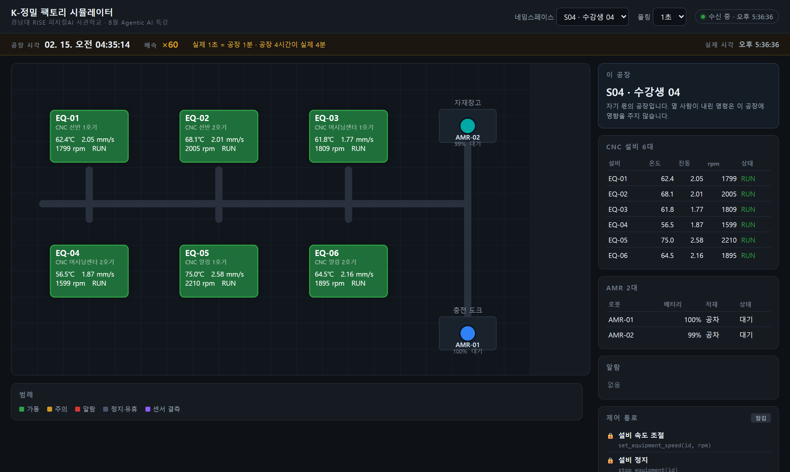
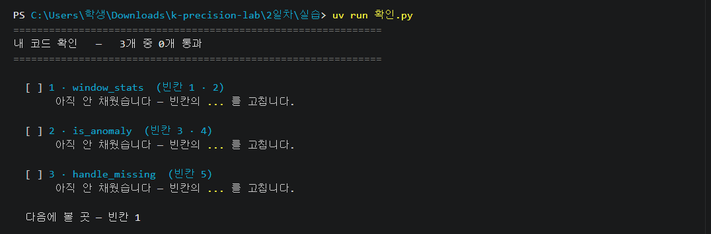
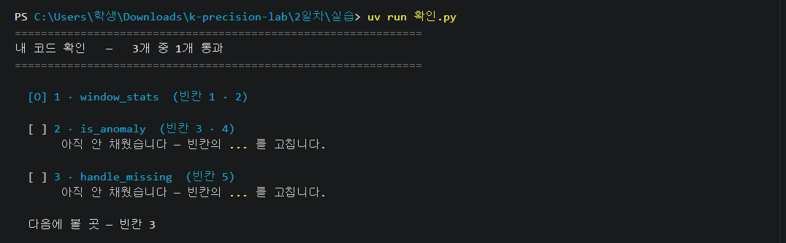
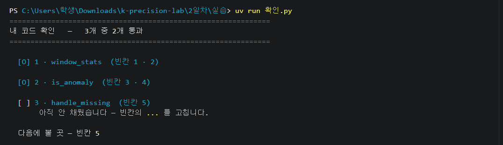
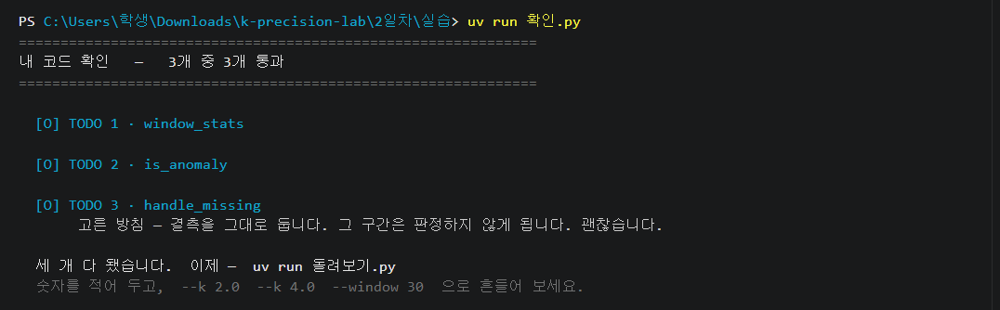
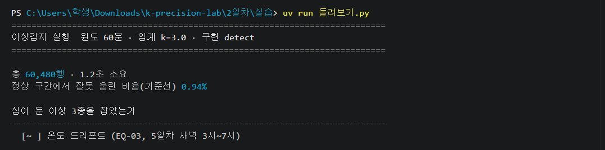

# 2일차 실습

---

## 1 · 내 공장을 켭니다

오늘 여러분 컴퓨터에 공장이 한 채 들어옵니다. 준비 안내에서 깔았던 **Docker** 가
이 공장을 담는 상자입니다 — 여는 명령 한 줄이면 공장이 돌아갑니다.
통째로 내 것입니다. 마음껏 만져도 되고, 망가지면 새것으로 갈아 끼우면 그만입니다.

**① VS Code 에서 터미널을 엽니다**

위 메뉴 **터미널 → 새 터미널**.
메뉴에 터미널이 안 보이면 창이 좁아서 접힌 것입니다 — 맨 위 `…` 안에 있습니다.


**② 공장 폴더로 들어갑니다**

```
cd 공장
```

**③ 공장을 켭니다**

```
docker compose up -d
```

준비 안내에서 미리 해 봤다면 몇 초면 켜집니다. 처음이면 몇 분 걸립니다 —
글자가 주르륵 지나가는 건 공장 부품을 내려받아 조립하는 중입니다.

---

## 2 · 내 공장을 눈으로 봅니다

**① 크롬을 열고, 주소창에 붙여넣습니다**

```주소
http://localhost:8000
```

`localhost` 는 **내 컴퓨터**라는 뜻입니다 — 이 공장은 인터넷이 아니라
여러분 컴퓨터 안에 있습니다.



**② 네 가지가 보이면 됩니다**

- 네모(CNC 기계) 6개 — `EQ-01` ~ `EQ-06`
- 동그란 점(로봇) 2개 — `AMR-01` `AMR-02`
- 네모 안 숫자가 1~2초마다 바뀜
- 화면 아래 **「이상 시작」** 버튼 — 아직 누르지 않습니다

**③ 여섯 대의 온도를 훑어봅니다**

제일 낮은 기계와 제일 높은 기계가 **20도 가까이 차이 나는데, 여섯 대 다 초록색 — 전부 정상**입니다.
회전이 빠른 기계일수록 뜨겁습니다. 분당 1600번 도는 기계는 56도,
2200번 도는 기계는 74도가 제자리입니다.
온도는 기계 겉면이 아니라 **회전축을 받치는 베어링 안쪽**에서 잽니다. 그래서 숫자가 이렇게 높습니다.

> **「정상」의 기준이 기계마다 다릅니다.**
> 그래서 여섯 대에 같은 선 하나를 그을 수 없습니다.

이 탭은 그대로 둡니다 — 잠시 뒤 이 화면에서 한 가지를 겪어 봅니다.

---

## 3 · 계속 지켜볼 수 있습니까

준비가 되면 화면 아래의 **「이상 시작」** 버튼을 누릅니다.
누르는 순간 여섯 대 중 **한 대**에 이상이 들어갑니다.
멈추거나 빨갛게 되는 것이 아닙니다. 온도만 아주 조금씩 오릅니다 —
어느 기계인지는 **알려 주지 않습니다.**

**① 30초쯤 화면을 봅니다**

어느 기계인지 짚어 봅니다.

**② 못 찾는 것이 보통입니다**

짚으셨다면 여섯 대 중 하나를 찍은 것입니다. 못 짚었어도 마찬가지입니다 —
30초 동안 본 것만으로는 **「이 기계다」라고 말할 근거가 없습니다.**

**③ 게다가 이건 계속 봐야 잡힙니다**

> **여섯 대 전부를, 밤새, 매일 지켜보실 수 있습니까?**

사람은 못 합니다. 눈이 나빠서가 아니라, **쉬어야 하기 때문**입니다.

---

## 4 · 그래서, 쉬지 않는 감시자를 만듭니다

사람 대신 화면을 지켜볼 감시자를 지금부터 만듭니다.

감시자가 지켜볼 것은 **실습 파일로 받은 7일치 센서 기록**(「데이터」 폴더,
6만 줄)입니다. 이 기록에는 이상이 심어져 있어서, 완성해서 돌리면 **무엇을
잡고 무엇을 놓치는지 드러납니다.** 만드는 동안은 `확인.py` 가 값 몇 개짜리
시험 문제로 빈칸 하나하나를 채점해 줍니다. 공장에 붙이는 것은 내일입니다.

감시자가 하는 일은 하나입니다 —

> **지금 값이, 그 기계의 평소에서 얼마나 벗어났는가.**

너무 벗어난 값을 만나면 감시자는 그 줄에 **알람을 냅니다** —
실제 관제 화면에서 담당자를 부르는 그 알람입니다.

여기서 「평소」는 판정하려는 값 **바로 앞 한 시간**입니다.
기록이 1분에 한 줄이라, 한 시간이면 값 60개입니다.

```수식
z = ( x − μ ) / σ

x : 지금 값        μ : 평소의 평균        σ : 평소의 흔들림
```

방금 봤듯 기계마다 평소 온도가 다르니, 80℃ 같은 고정선 하나로는 안 됩니다.
그래서 감시자는 **그 기계의 최근 값들**로 평소를 매번 새로 잽니다.

**① 왼쪽 탐색기에서 `2일차` → `실습` → `detect.py` 를 엽니다**

감시자의 뼈대가 이미 들어 있고, **비어 있는 곳이 다섯 군데** 있습니다.
오늘 고치는 파일은 이 하나뿐입니다.

**② `Ctrl`+`F` 로 `빈칸` 을 칩니다**

`빈칸 1` 부터 `빈칸 5` 까지 차례로 걸립니다. **채우는 방법은 각 빈칸 바로 위 주석에** 적혀 있습니다.

| 빈칸 | 고칠 줄 | 감시자가 얻는 것 |
|---|---|---|
| 1 | `mean = ...` | 평소의 평균 |
| 2 | `var = ...` | 평소의 흔들림 |
| 3 | `return ...` | 평소가 한 번도 안 흔들린 자리의 판단 |
| 4 | `return ...` | 판정 — 평소 흔들림의 몇 배부터 이상인가 |
| 5 | `방침 = ...` | 값이 빈 자리를 어떻게 할지 |


빈칸마다 리듬은 같습니다 — **고치고, `Ctrl`+`S` 로 저장하고, 확인 명령을 칩니다.**
(탭 이름 옆에 ● 이 남아 있으면 아직 저장 전입니다)

---

## 5 · 감시자는 아직 비어 있습니다

채우기 전에 한 번 돌려 봅니다.

```
uv run 확인.py
```

**나오는 화면**



빈칸을 채울 때마다 이 명령을 다시 칩니다.
`[ ]` 가 `[O]` 로 바뀌면 그 자리는 끝난 것입니다.

---

## 6 · 「평소」를 가르칩니다 — 빈칸 1 · 2

벗어남을 재려면 평소부터 계산할 수 있어야 합니다.
`빈칸 1` 이 평소(바로 앞 한 시간)의 **평균**, `빈칸 2` 가 그 **흔들림**입니다. 채웠으면 —

```
uv run 확인.py
```

**나오는 화면**



**막히면 정답을 넣고 갑니다**

```
uv run 확인.py --정답 1
```

뒤의 숫자는 **화면에 찍히는 함수 번호**입니다.

| 번호 | 함수 | 빈칸 |
|---|---|---|
| 1 | window_stats | 빈칸 1 · 2 |
| 2 | is_anomaly | 빈칸 3 · 4 |
| 3 | handle_missing | 빈칸 5 |

이제 평소를 잴 수 있습니다. 다음은 **몇 배부터 이상이라 부를지**입니다.

---

## 7 · 몇 배부터 이상인가 — 빈칸 3 · 4

평소에서 벗어났다고 다 이상은 아닙니다. 정상일 때도 값은 조금씩 흔들립니다.
그래서 **평소 흔들림의 몇 배부터 이상으로 볼지** 선을 하나 긋습니다 —
그 배수가 코드의 **`k`** 이고, 기본은 3입니다.
평소 흔들림의 **세 배**를 벗어나면 이상으로 봅니다.

**`빈칸 3`** — 판정에 앞서 걸림돌 하나를 치웁니다. 벗어남은 흔들림으로
나눠서 재는데, 최근 한 시간 내내 값이 완전히 똑같았다면 **흔들림이 0** 이라
나눌 수가 없습니다. 이 경우를 어떻게 볼지 여기서 정합니다.

**정답이 두 개입니다.**
- 「한 시간 내내 똑같다가 지금 값이 달라졌다면, 그것부터 이상하다」 → 이상으로 본다
- 「흔들림을 재지 못했으니 판정할 수 없다」 → 이상이 아니라고 본다

둘 중 하나를 골라 적고, 왜 골랐는지만 말할 수 있으면 됩니다.

**「그래서 정답이 뭔데?」** — 이 자리는 **정해진 답이 없습니다.**
화재경보기 민감도를 몇에 맞추는 게 정답이냐는 질문과 같습니다 —
민감하면 고기 굽는 연기에도 울리고, 둔하면 진짜 불을 늦게 잡습니다.
주방이면 조금 둔하게, 서버실이면 민감하게. **다는 곳에 따라 적정선이
다르고, 그걸 정하는 사람이 엔지니어입니다.** 지금은 여러분이 그 사람입니다.
감으로 찍고 끝도 아닙니다 — **잠시 뒤 7일치에 돌리면 그 선택의 결과가
숫자로 나오고**, 보고 마음이 바뀌면 고쳐서 다시 돌리면 됩니다.

**`빈칸 4`** — 본판정 한 줄입니다. 벗어남이 `k` 배를 넘으면 이상.
위로 벗어난 것도 아래로 벗어난 것도 이상이라 **절댓값**으로 봅니다.

```
uv run 확인.py
```

**나오는 화면**



**막히면 정답을 넣고 갑니다**

```
uv run 확인.py --정답 2
```

선을 그었습니다. 마지막으로, **값이 아예 안 들어온 자리**가 남았습니다.

---

## 8 · 값이 빠진 2시간 — 빈칸 5

센서가 죽으면 값이 안 들어옵니다. 잠시 뒤에 돌릴 **7일치 기록**에도 그런 자리가
있습니다 — `EQ-01` 이 **2시간 동안** 값을 안 남겼습니다.

그 구간을 감시자가 어떻게 다룰지, `빈칸 5` 에 **숫자 하나로** 정합니다.

**`1` 을 적으면** — 빈 자리를 그냥 둡니다.
없는 값을 지어내지 않는 대신, 그 2시간은 못 봅니다.

**`2` 를 적으면** — 바로 앞 값으로 메웁니다.
판정할 구간이 늘어나는 대신, 2시간 내내 같은 값이 들어가고 —
값이 돌아오는 순간 **없던 이상이 하나 생깁니다.**

**여기서 할 일은 둘 중 하나를 고르는 것입니다.** 빈칸 3 처럼 정답이 두 개고,
얻는 것과 잃는 것이 다를 뿐입니다. 왜 골랐는지만 말할 수 있으면 됩니다.

두 경우의 코드는 이미 파일에 들어 있습니다. 숫자 하나만 적으면 됩니다.

> **잠시 뒤 옆 사람과 결과가 다를 수 있습니다.**
> 틀린 것이 아니라 **여기서 다른 쪽을 골랐기 때문**입니다.

```
uv run 확인.py
```

**나오는 화면**



`고른 방침` 줄은 무엇을 골랐느냐에 따라 다르게 나옵니다.

**막히면 정답을 넣고 갑니다**

```
uv run 확인.py --정답 3
```

정답 넣기는 방침을 `1` 로 적어 줍니다.
직접 `2` 를 적었다면 **그것도 정답이니 그대로 두면 됩니다.**

**감시자가 완성됐습니다.** 이제 진짜 데이터에 풀어놓습니다.

---

## 9 · 7일치 기록에 돌립니다

지금까지 `확인.py` 가 푼 것은 값 몇 개짜리 시험 문제였습니다.
이제 **진짜 7일치 60,480줄**입니다. 감시자가 무엇을 잡고 무엇을 놓치는지 여기서 드러납니다.

```
uv run 돌려보기.py
```

**나오는 화면**



`돌려보기.py` 는 여러분이 만든 감시자를 **온도와 진동, 두 데이터에** 돌립니다.
그래서 결과에는 진동 이상도 같이 나옵니다.

결과를 읽기 전에 말 두 개부터. 감시자가 틀리는 방법은 두 가지고,
**현장에서 쓰는 이름이 각각 있습니다.**

| 용어 | 무엇 |
|---|---|
| **오탐** | 아무 일 없는데 알람을 낸 것 |
| **미탐** | 이상인데 알람을 못 낸 것 |

**오탐은 없앨 수 없습니다.** 정상 값도 늘 조금씩 흔들리는데 그 흔들림이 아주
가끔 우연히 크게 튀고, 6만 줄을 재면 그런 우연이 수백 번 쌓이기 때문입니다.
**줄일 수만 있습니다.**

이제 결과입니다. 이 기록에는 이상이 **세 개** 심어져 있고,
이어서 나오는 세 줄이 그 하나하나를 **잡았나 못 잡았나**입니다.

| 표시 | 뜻 |
|---|---|
| `[O ]` | 잡았다 |
| `[  ]` | **미탐** — 한 번도 알람이 안 났다 |
| `[~ ]` | 알람은 났는데, **오탐과 구별이 안 된다** — 미탐과 같다 |

`[~ ]` 는 이런 경우입니다. 이상이 세 시간 이어졌고, 그동안 알람이 두 번
났다고 해 봅시다. 잡은 것 같지만 — 이 감시자는 **아무 일 없는 세 시간**에도
오탐을 두 번쯤 냅니다. 이상 구간의 알람 수가 오탐 수준과 같으면,
**이상을 보고 낸 알람이라는 증거가 없습니다.**

셋 중 결측 줄은 옆 사람과 다를 수 있습니다. `빈칸 5` 에서 `1`(그냥 둔다)을
골랐다면 그 2시간은 아예 판정을 안 하니 **0 이 맞는 결과**입니다.

맨 아래에 **오탐이 7일 동안 모두 몇 번이었는지** 나옵니다.
이 숫자를 적어 두세요. **다음 단계에서 이 숫자를 줄이는 것이 목표**입니다.

---

## 10 · 오탐을 하루 30번 아래로

방금 화면 맨 아래를 보세요. **오탐이 하루 여든 번쯤** 됩니다.

오탐이 왜 문제인가 — 알람이 나면 담당자는 가 봐야 합니다. 그런데 가 보면
대부분 아무 일도 없습니다. 하루 여든 번, 십 분에 한 번꼴로 그게 반복되면
사람은 **알람을 믿지 않게 됩니다.** 울려도 안 가 보게 되는 순간,
감시자는 만들지 않은 것과 같습니다.

**① 목표**

> **찾아낸 이상 개수를 그대로 둔 채, 오탐을 하루 30번 아래로 내리세요.**

지금은 이상 **3종 중 1종**을 찾아냈고, 오탐이 **하루 여든 번**입니다.
찾아낸 개수는 그대로 두고 오탐만 서른 번 아래로 내리는 것이 이번 실습입니다.

**왜 「찾아낸 개수를 그대로」인가** — 오탐을 0으로 만드는 건 쉽습니다.
`k` 를 크게 올리면 거의 안 울립니다. **아무것도 못 찾아서** 그렇습니다.
그건 감시자가 아니라 꺼 놓은 것과 같습니다.

**왜 하필 30번인가** — 이번 실습의 목표로 정한 숫자입니다.
20번이든 10번이든 더 내려가면 그만큼 좋습니다. **찾아낸 개수만 안 줄어든다면요.**

**② 손잡이는 둘뿐입니다**

**`k`** 는 평소 흔들림의 몇 배부터 이상으로 볼지, **`window`** 는 평소를 몇 개로 잴지입니다.
지금은 `k=3.0` · `window=60` 입니다. 한 번에 하나씩만 바꿉니다.

```
uv run 돌려보기.py --k 3.2
```

```
uv run 돌려보기.py --window 90
```

값은 자유입니다. `3.2` 든 `4.3` 이든 넣어 보세요.

**③ 돌릴 때마다 두 숫자를 같이 봅니다**

화면에 **「찾아낸 이상 3종 중 N종 · 오탐 하루 N번」**이 한 줄로 나옵니다.
한쪽만 보면 속습니다 — 오탐이 줄었는데 찾아낸 개수도 같이 줄었다면 얻은 것이 없습니다.

**④ 3종을 다 찾아내는 값은 없습니다**

돌리다 보면 알게 됩니다. **하나를 얻으면 하나를 놓칩니다.**

민감하게 하면 이상은 더 찾아내지만 **오탐**이 늘고, 둔하게 하면 오탐은 줄지만
**미탐**이 늘어납니다. **둘 다 손해입니다 — 어느 손해가 더 아픈지가 공장마다
다를 뿐입니다.** 놓친 이상이 부품 파손으로 이어지는 공장이면 미탐이 더 아프고,
알람마다 사람이 뛰어가야 하는 공장이면 오탐이 더 아픕니다.

> **어디서 타협할지 정하는 것, 그게 오늘 여러분이 하는 판단입니다.**

**⑤ 정했으면 적어 두세요**

세 줄이면 됩니다. 마지막 20분에 노션에 옮길 것입니다.

- 내가 정한 값 — `k` 는 얼마, `window` 는 얼마
- 그 값에서 나온 결과 — 이상 3종 중 몇 종, 오탐은 하루 몇 번
- **그렇게 정한 이유**

**정답은 없습니다. 근거가 있으면 됩니다.**

---

값과 이유를 적어 뒀으면 오늘의 만들기는 끝입니다.
마지막으로, **같은 감시자를 AI 는 어떻게 짜는지** 강사 화면으로 잠깐 봅니다.

---

## 오늘 한 것

여섯 대가 저마다 다른 온도에서 도는 공장을 봤고, 30초 쳐다봐서는 이상을 못
짚는다는 것을 확인했습니다. 그래서 쉬지 않는 감시자를 다섯 줄로 직접 채웠고,
7일치 6만 줄에 돌렸고, `k` 를 흔들며 오탐과 미탐 사이에서 내 값을 정했습니다.

### 남은 문제 둘 — 내일 다룹니다

**하나, 서서히 오르는 이상은 못 잡았습니다.**
`k` 를 아무리 낮춰도 안 잡히고 오탐만 늘었습니다. 감시자의 평소가 **최근
값들**이라, 온도가 천천히 오르면 평소도 같이 따라 오르기 때문입니다.

**둘, 잡아도 「왜」는 모릅니다.**
감시자는 「EQ-03 이 이상하다」까지만 말합니다. 정비 담당이 남긴
*"부품 입고 지연으로 점검 보류"* 같은 메모는 읽지 못합니다.

내일은 오늘 짠 `detect.py` 를 그대로 들고 이 둘을 해결합니다.
