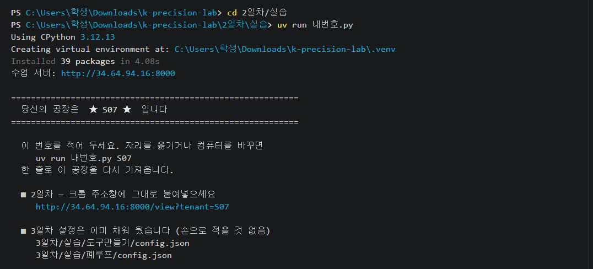
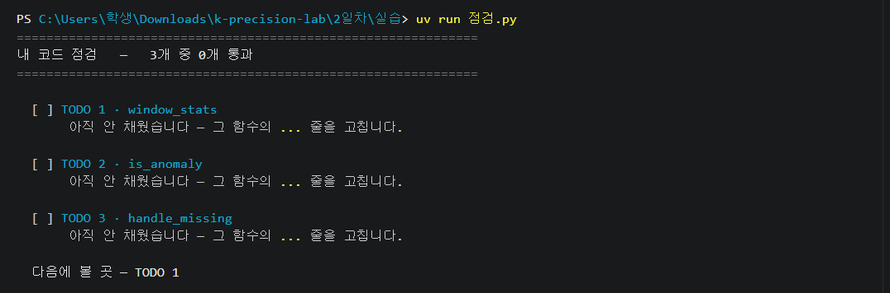
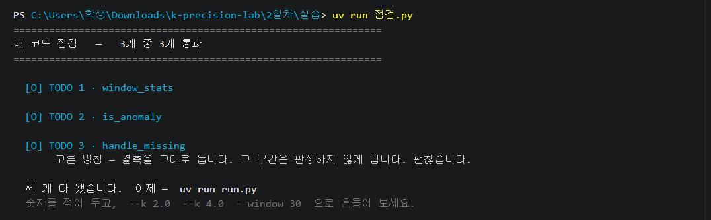
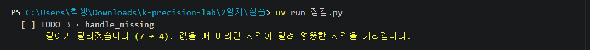
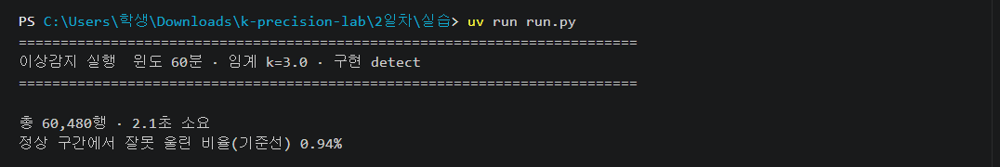
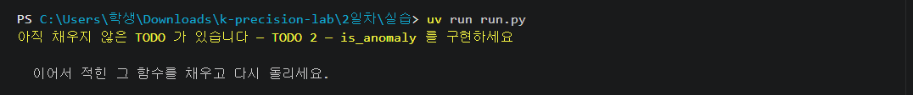

# 2일차 실습

---

## 1 · 내 공장 받기

서른아홉 개의 공장이 돌고 있고, 그중 하나가 내 것이 됩니다. 번호를 받아야 시작됩니다.

**① VS Code 에서 터미널을 엽니다**
위 메뉴 터미널 → 새 터미널

메뉴에 터미널이 안 보이면 창이 좁아서 접힌 것입니다. 맨 위 `…` 을 누르면 그 안에 있습니다.


**② 실습 폴더로 들어갑니다**

```
cd 2일차/실습
```

**③ 공장을 받습니다**

```
uv run 내번호.py
```

처음이면 1~2분 걸립니다. 글자가 주르륵 지나가는 건 필요한 것을 갖추는 중입니다.

**나오는 화면**



★ 사이의 번호를 적어 두세요. 사람마다 다릅니다.

**안 되면**

**`uv 은(는) …용어로 인식되지 않습니다`**
→ `uv` 를 못 찾고 있습니다 — VS Code 를 껐다 켜고, `k-precision-lab` 을 **폴더로** 엽니다 (파일 하나만 열면 안 됩니다)

**`지정된 경로를 찾을 수 없습니다`**
→ 실습 폴더 밖에서 쳤습니다 — `cd 2일차/실습` 을 먼저 칩니다

**`warning: Failed to hardlink files …`**
→ 드라이브가 달라 복사로 넘어갔습니다 — **그대로 두세요.** 몇 초 더 걸릴 뿐이고, 아래에 `Installed …` 가 뜨면 정상입니다

**`서버에 닿지 못했습니다`**
→ 인터넷이 끊겼거나 실습실이 막고 있습니다 — 혼자 풀 수 없습니다. **손을 드세요.**

**이 명령은 몇 번을 쳐도 같은 번호가 나옵니다.** 이틀 내내 이 번호를 씁니다.

---

## 2 · 내 공장 눈으로 보기

앞으로 잡을 이상이 어떻게 생겼는지 먼저 봅니다. 숫자만 보면 감이 안 옵니다.

**① 크롬을 엽니다**

**② 방금 화면에 뜬 주소를 주소창에 붙여넣습니다**

```
http://34.64.94.16:8000/view?tenant=내번호
```

`내번호` 자리에 내 번호가 들어갑니다. 타자로 치지 말고 화면에 찍힌 주소를 복사하세요. 옆 사람 번호를 넣으면 남의 공장이 열립니다.

**나오는 화면**


**③ 네 가지를 확인합니다**

- 네모(CNC 기계) 6개 — `EQ-01` ~ `EQ-06`
- 동그란 점(로봇) 2개 — `AMR-01` `AMR-02`
- 네모 안 숫자가 1~2초마다 바뀜
- 오른쪽 위에 내 번호

**④ 여섯 대의 온도를 눈으로 훑어봅니다**

제일 낮은 기계와 제일 높은 기계가 **20도 가까이 차이 납니다.**
그런데 여섯 대 다 초록색, **전부 정상**입니다. 원래 그 온도에서 도는 기계들입니다.

**한 기계에게 정상인 온도가, 다른 기계에게는 이상일 수 있습니다.**

**⑤ 이 탭은 닫지 않습니다**

**안 되면**

**흰 화면만 나온다**
→ 주소가 덜 붙었습니다 — 맨 앞에 `http://` 가 있는지 봅니다. 타자로 치지 말고 터미널에 찍힌 주소를 복사하세요

**네모는 있는데 숫자가 안 바뀐다**
→ 화면이 멈춰 있습니다 — `F5` 로 새로 고칩니다

**오른쪽 위 번호가 내 번호가 아니다**
→ 남의 공장을 열었습니다 — `uv run 내번호.py` 로 내 주소를 다시 확인합니다

**여섯 대가 저마다 다른 온도에서 돕니다. 이걸 기억해 두세요.**

---

## 3 · 사람 눈으로 되는지 확인하기

방금 여섯 대 중 **한 대**에 이상이 들어갔습니다.
멈추거나 빨갛게 되는 것이 아닙니다. 온도만 아주 조금씩 오릅니다.

**① 30초쯤 화면을 봅니다**

어느 기계인지 짚어 보세요. 오래 붙잡지 마세요.

**② 못 짚는 것이 정답입니다**

맞히는 시간이 아닙니다. **사람 눈으로 되는지 확인하는 시간**입니다.

**왜 안 보일까요. 이상이 작아서가 아닙니다.**

여섯 대 모두 정상일 때도 온도가 **±0.6℃ 쯤 쉬지 않고 오르내립니다.** 부하가 바뀌고
냉각이 돌기 때문입니다. 화면을 2분 보면 어느 기계든 오르락내리락합니다.

이상이 든 기계는 그 흔들림 위에 **한 방향으로 조금씩 쌓입니다.** 2분에 0.5℃ 남짓.
**흔들림보다 작습니다.** 그래서 「오른다」인지 「그냥 흔들린다」인지 갈라낼 수가 없습니다.

**한 방향으로 쌓이는지 보려면 최소 몇십 분을 지켜봐야 합니다.**
사람이 여섯 대를 그렇게 볼 수는 없습니다.

색도 안 바뀝니다. 색이 바뀌는 기준은 **80℃** 인데, 이 이상은 4시간 동안 **2℃** 올라
63.9℃ 에서 멈춥니다. **7일 내내 80℃를 넘는 일이 한 번도 없습니다.**

**③ 그래서 사람 대신 계산이 필요합니다**

한 번 보고 아는 것이 아니라, **그 기계의 최근 값들과 견주어** 판정해야 합니다.
설비 6대를 1분마다 7일 내내 그렇게 보는 것은 사람이 할 수 없습니다.
**그걸 하는 함수를 이제 짭니다.**

> **오늘은 온도만 봅니다.** 이 공장은 진동도 회전수도 같이 기록하는데,
> 오늘 짜는 코드는 온도 하나만 봅니다. 값이 하나여야 계산이 눈에 들어오니까요.
>
> 실제로는 **진동이 온도보다 먼저 신호를 냅니다.** 온도는 늦게 나타나는 지표라
> 온도만 보면 놓치는 것이 생깁니다. **내일 만드는 도구는 온도와 진동을 같이 봅니다.**

---

## 4 · 고칠 파일 열기

오늘 손대는 파일은 하나뿐입니다. 어디를 채우는지 먼저 봅니다.

**① 왼쪽 탐색기에서 `2일차` → `실습` → `detect.py` 를 누릅니다**

**② `Ctrl`+`F` 를 누르고 `TODO` 를 칩니다**

세 군데가 표시됩니다.

| 자리 | 함수 | 하는 일 |
|---|---|---|
| `# TODO 1` | `window_stats` | 앞 W개로 평균과 표준편차를 낸다 |
| `# TODO 2` | `is_anomaly` | z-score 가 k 를 넘는지 판정한다 |
| `# TODO 3` | `handle_missing` | 값이 안 들어온 자리를 다룬다 |

<!-- 사진 실습_2_detect열기.png
     VS Code 전체 화면. 왼쪽 탐색기에 2일차 > 실습 이 펼쳐져 있고
     오른쪽에 detect.py 가 열려 TODO 1 주석이 보이는 상태.
     파일 탭(detect.py)까지 나오게. -->

만드는 것은 이동 윈도 z-score 입니다.

```
z = ( x − μ ) / σ

x : 지금 값        μ : 최근 W개의 평균        σ : 최근 W개의 표준편차
```

함수 이름은 바꾸지 않습니다. 다른 파일들이 이 이름으로 불러 씁니다.

---

## 5 · 지금 어디까지 됐는지 보기

채우기 전 상태를 눈에 넣어 둡니다. 앞으로 하나 채울 때마다 이 명령으로 확인합니다.

```
uv run 점검.py
```

**나오는 화면**



**`[ ]` 가 `[O]` 로 바뀌면 그 자리는 끝난 것입니다.**

---

## 6 · 평균과 표준편차 구하기

지금 값이 평소와 얼마나 벗어났는지 재려면 먼저 「평소」가 뭔지 정해야 합니다.

**① `# TODO 1: 여기를 채우세요` 아래 이 줄을 지웁니다**

```
    raise NotImplementedError("TODO 1 — window_stats 를 구현하세요")
```

줄 맨 끝을 클릭하고 `raise` 앞까지만 `Backspace` 로 지우면 앞쪽 빈칸(공백 4칸)이 남습니다.

**② 그 자리에 코드를 씁니다**

`i` 번째 값 **바로 앞** `window` 개로 `(평균, 표준편차)` 를 돌려줍니다.

- 지금 값(`values[i]`)은 넣지 않습니다. 넣으면 튀는 값이 자기 평균을 끌어올려 자기를 숨깁니다
- 앞이 모자라면(`i < window`) `None` 을 돌려줍니다
- 표준편차는 표본 표준편차 — `(개수 − 1)` 로 나눕니다

「i 바로 앞의 window 개」는 이렇게 씁니다.

```
values[i - window:i]
```

제곱근은 `math.sqrt(...)` 또는 `x ** 0.5`.

**③ `Ctrl`+`S` 로 저장합니다**

파일 탭 이름 옆에 ● 점이 있으면 아직 저장 안 된 것입니다. 저장을 안 하면 고치기 전 코드가 그대로 돕니다.

**④ 확인합니다**

```
uv run 점검.py
```

**안 되면** — 제일 많이 나는 둘입니다.

![지금 값을 평균에 넣었을 때 — `values[i - window:i]` 로 지금 값을 뺍니다](그림/실습/에러_2_지금값.png)


**`지금 값(99)까지 평균에 넣었습니다`**
→ 자르는 구간에 지금 값이 들어갔습니다 — `values[i - window:i]` 로 씁니다. 뒤가 `i+1` 이면 지금 값이 딸려 들어갑니다

**`표준편차를 개수로 나눴습니다`**
→ 모표준편차를 냈습니다 — 나누는 수를 `(개수 − 1)` 로 바꿉니다

**`표준편차가 1.5811 여야 하는데 …가 나왔습니다`**
→ 값은 나오는데 숫자가 다릅니다 — 자르는 구간과 나누는 수 둘 다 봅니다

**`앞이 모자란 자리(i < window)에서도 값을 돌려줍니다`**
→ 앞 데이터가 모자란데 계산했습니다 — 함수 맨 위에 `if i < window: return None` 을 둡니다

**`앞이 모자란 자리에서 터집니다`**
→ 같은 이유인데 예외로 죽었습니다 — 위와 같습니다. `i < window` 를 **맨 먼저** 거릅니다

**`detect.py 58행에 문법 오류가 있습니다 — expected an indented block …`**
→ `raise` 를 지우면서 앞쪽 빈칸까지 지웠습니다 — 적힌 줄로 가서 공백 4칸을 맞춥니다

막혔으면 힌트를 단계로 받습니다 — `uv run 점검.py --힌트 1` 부터.
시간이 다 됐으면 **9번**으로 가서 그 자리만 열고 계속 갑니다.

---

## 7 · 이상인지 판정하기

기준이 생겼으니 이제 선을 긋습니다. 얼마나 벗어나야 이상이라고 부를 것인가.

**① `# TODO 2: 여기를 채우세요` 아래 이 줄을 지우고 그 자리에 씁니다**

```
    raise NotImplementedError("TODO 2 — is_anomaly 를 구현하세요")
```

**② z-score 의 절댓값이 `k` 를 넘으면 이상으로 봅니다**

```
z = (value - mean) / std
```

위로 벗어난 것도 아래로 벗어난 것도 이상입니다. 절댓값은 `abs(...)`.

표준편차가 0 인 순간이 실제로 있습니다. 값이 한동안 완전히 똑같았다는 뜻인데, 그때 무엇을 돌려줄지는 여러분이 정하고 이유를 말할 수 있으면 됩니다. 0 으로 나누면 파이썬은 조용히 넘어가지 않고 멈춥니다.

**③ `Ctrl`+`S` 로 저장하고 확인합니다**

```
uv run 점검.py
```

**안 되면**

**`z=10 인데 이상이 아니라고 합니다`**
→ 크게 벗어났는데 정상이라 했습니다 — 부등호가 반대입니다. `> k` 로 씁니다

**`z=1 인데 이상이라고 합니다`**
→ 멀쩡한 값을 이상이라 했습니다 — 같은 이유입니다. `< k` 가 아니라 `> k` 입니다

**`아래로 크게 벗어난 값(z=−10)을 못 잡습니다`**
→ 위로 튄 것만 잡고 있습니다 — `abs(...)` 로 절댓값을 씌웁니다

**`표준편차가 0 인 구간에서 터집니다`**
→ 0 으로 나눴습니다 — 나누기 전에 `std` 가 0 인 경우를 먼저 처리합니다

시간이 다 됐으면 **9번**으로 가서 그 자리만 열고 계속 갑니다.

---

## 8 · 값이 없는 자리 정하기

센서가 죽으면 값이 안 들어옵니다. 이 데이터에는 `EQ-01` 에 2시간(120개)짜리 빈 구간이 있습니다.

**① `# TODO 3: 여기를 채우세요` 아래 이 줄을 지우고 그 자리에 씁니다**

```
    raise NotImplementedError("TODO 3 — handle_missing 를 구현하세요")
```

**② 방침 하나를 골라 구현합니다**

- 그냥 둔다 — 그 구간은 판정하지 않는다
- 직전 값으로 메운다
- 앞뒤 값의 평균으로 메운다
- 값이 없다는 것 자체를 이상으로 본다

정답이 하나가 아닙니다. 무엇을 골랐든 왜 그렇게 했는지 말할 수 있으면 됩니다.

돌려주는 목록의 길이는 원래와 같아야 합니다. 값을 빼 버리면 시각이 밀려 엉뚱한 시각을 가리킵니다.

값이 없는지 확인하는 방법은 `== None` 이 아니라 이것입니다.

```
if v is None:
```

**③ `Ctrl`+`S` 로 저장하고 확인합니다**

```
uv run 점검.py
```

**나오는 화면**




`고른 방침` 안내는 여러분이 무엇을 골랐느냐에 따라 다르게 나옵니다.

**안 되면**



**`길이가 달라졌습니다 (7 → 4)`**
→ 값이 없는 자리를 빼 버렸습니다 — 빼지 말고 그 자리에 그대로 둡니다. 빼면 시각이 밀립니다

**`리스트를 돌려줘야 하는데 tuple 이 나왔습니다`**
→ 괄호를 `( )` 로 썼습니다 — `[ ]` 로 바꿔 목록으로 돌려줍니다

**`detect.py 58행에 문법 오류가 있습니다`**
→ 그 줄에 오타가 있습니다 — 적힌 줄로 가서 괄호·따옴표·들여쓰기를 봅니다

시간이 다 됐으면 **9번**으로 가서 그 자리만 열고 계속 갑니다.

---

## 9 · 막혔으면 답을 보고 갑니다

**여기서 오래 붙잡고 있으면 오늘 제일 중요한 것을 못 봅니다** — 내 코드로 7일치를 돌려
숫자가 어떻게 움직이는지 보는 것. 막히면 **맨 뒤 「참고 답안」** 을 펴서 옮겨 적고 계속 가세요.

부끄러워할 일이 아닙니다. 처음 짜 보는 사람이 40분에 세 개를 다 채우는 게 오히려 드뭅니다.

명령으로 채우고 싶으면 이것도 됩니다.

```
uv run 점검.py --열기 2
```

맨 뒤 `2` 자리에 막힌 TODO 번호를 넣습니다. 나머지는 여러분이 쓴 것 그대로 남습니다.

**옮겨 적은 함수는 나중에 한 번 읽어 보세요. 어디서 막혔는지 보입니다.**

---

## 10 · 7일치에 돌려 보기

지금까지 `점검.py` 는 **값 몇 개짜리 시험 데이터**로 함수가 맞게 도는지만 봤습니다.
이제 **진짜 7일치 60,480줄**에 태웁니다. 여기서부터 내 코드가 무엇을 잡고 무엇을 놓치는지 드러납니다.

> **다 채웠어도 여기서 멈춥니다.** 강사가 "다 같이 엔터" 라고 하면 그때 칩니다.

```
uv run run.py
```

**나오는 화면**



이어서 심어 둔 이상 3종을 각각 잡았는지가 세 줄로 나오고, 마지막에 아닌데 잘못 울린 것이 몇 줄인지 나옵니다. 걸린 시간과 비율은 여러분이 어떻게 짰느냐에 따라 다릅니다.

**읽는 법**

| 표시 | 뜻 |
|---|---|
| `[O ]` | 잡았다 |
| `[  ]` | 못 잡았다 |
| `[~ ]` | 울리긴 했는데, 정상 구간에서 울리는 빈도와 다를 게 없다 |

`[~ ]` 는 잡은 것이 아닙니다. 아무 데서나 그만큼 울리고 있으니까요.

**이 화면을 끄지 마세요.** 다음 단계에서 숫자를 바꿔 가며 지금 이 결과와 견줍니다.
특히 맨 아래 **「아닌데 울린 것」** 이 몇 번인지 눈에 넣어 두세요.

**안 되면**

**`아직 채우지 않은 TODO 가 있습니다`**
→ 세 자리 중 하나가 비었습니다 — 뒤에 적힌 그 함수를 채우고 다시 돌립니다

**`0 으로 나눴습니다`**
→ 표준편차 0 인 구간을 만났습니다 — **7번**의 `std == 0` 처리를 넣습니다

**`값이 없는 자리(None)를 계산에 넣은 것 같습니다`**
→ 빈 자리를 숫자처럼 다뤘습니다 — **8번**의 방침을 먼저 정합니다

**`센서 데이터를 못 찾았습니다`**
→ `데이터` 폴더가 없습니다 — zip 을 풀 때 폴더째 풀렸는지 봅니다. `k-precision-lab` 안에 `데이터` 가 있어야 합니다

**몇 초 동안 아무것도 안 뜨는 것은 정상입니다** — 60,480줄을 도는 중입니다.



---

## 11 · 숫자를 흔들어 보기

기본값이 정답인지 확인합니다. 한 번에 하나씩만 바꿉니다.

**① 더 민감하게**

```
uv run run.py --k 2.0
```

**② 더 둔하게**

```
uv run run.py --k 4.0
```

**③ 보는 구간을 짧게**

```
uv run run.py --window 30
```

**④ 돌릴 때마다 두 숫자를 같이 봅니다**

- **잡은 것** — 심어진 이상 3종 중 몇 개
- **아닌데 울린 것** — 하루 약 몇 번

한쪽만 보면 속습니다. `k` 를 낮추면 더 잡히지만, **그 대신 무엇을 치렀는지**를 같이 봐야 합니다.

**더 잡으려 하면 헛울림이 는다 — 오늘의 한 문장입니다.**

이제 마지막으로, 같은 함수를 AI 에게 시키면 어떻게 다른지 봅니다.

---

## 12 · AI 가 짠 것과 나란히 놓기

같은 일을 AI 에게 시키면 어떤 코드가 나오는지, **그리고 그게 내 것보다 나은지** 봅니다.
이 자리는 강사가 앞에서 합니다. 여러분은 화면을 보면 됩니다.

**① 강사가 AI 에게 시킵니다**

여러분이 아침부터 채운 그 함수를, 말 몇 줄로 만들게 합니다.

**② 나온 코드를 같이 읽습니다**

특히 두 곳을 봅니다.

- **표준편차를 무엇으로 나눴나** — 개수인가, 개수−1 인가
- **값이 없는 자리를 어떻게 했나** — 그냥 뒀나, 메웠나

**③ 그 코드를 같은 데이터에 돌립니다**

여기가 핵심입니다. 코드만 보면 어느 쪽이 나은지 알 수 없습니다.
**여러분이 아까 본 그 화면**이 AI 코드로 다시 나옵니다.

| | 내가 짠 것 | AI 가 짠 것 |
|---|---|---|
| 심어진 이상 3종 중 몇 개 | ? | ? |
| **아닌데 울린 것** — 하루 몇 번 | ? | ? |

**④ 그래서 어느 쪽입니까**

숫자가 갈리면 이유를 찾을 수 있습니다. 표준편차를 개수로 나누면 값이 작아지고,
작은 표준편차로 나눈 z 는 커집니다. **더 자주 울린다는 뜻입니다.**

**AI 가 짠 코드가 맞는지 틀린지를 숫자로 말할 수 있는 것 — 그게 오늘 얻은 것입니다.**
짜 본 적이 없으면 이 판정을 할 수 없습니다.

---

## 오늘 여기까지 왔습니다

| | 오늘 한 것 |
|---|---|
| **봤다** | 여섯 대가 저마다 다른 온도에서 도는 것, 그리고 이상이 눈에 안 걸리는 것 |
| **짰다** | 최근 값과 견줘 판정하는 함수 셋을 채워 7일치에 돌렸다 |
| **쟀다** | `k` 를 바꿔 가며 무엇이 늘고 무엇이 주는지 숫자로 봤다 |
| **판정했다** | AI 가 짠 코드와 내 것을 같은 데이터에 태워 견줬다 |

### 그런데 두 가지가 남았습니다

**하나 — 못 잡은 것이 있습니다.**

서서히 오르는 그 이상, 여러분 코드가 `[~ ]` 로 흘려보낸 것입니다.
`k` 를 아무리 낮춰도 안 잡혔고, 낮추면 헛울림만 늘었습니다.

최근 값의 평균을 기준으로 삼는데, 온도가 천천히 오르면 **기준도 같이 따라 올라갑니다.**
지금 값과 기준의 거리가 안 벌어집니다. **내일 다른 방법으로 잡습니다.**

**둘 — 잡아도 「왜」를 모릅니다.**

여러분 코드는 「EQ-03 이 이상하다」까지만 말합니다.
왜 그런지, 무엇을 해야 하는지는 **여러분이 미리 정해 둔 것만** 말할 수 있습니다.
정비 담당이 남긴 *"부품 입고 지연으로 점검 보류"* 같은 메모는 읽지 못합니다.

**내일 그것을 읽고 원인을 대는 것까지 만듭니다.**

---

**오늘 짠 `detect.py` 를 그대로 씁니다 — 지우지 마세요. 번호도 적어 두세요.**

---

# 참고 답안

**막혔을 때만 보세요.** 먼저 10분은 스스로 해 보는 게 훨씬 남습니다.
그래도 안 되면 여기를 보고 옮겨 적고 계속 가세요 — 오늘의 핵심은 이 함수를 혼자 떠올리는 것이 아니라,
**내 코드로 7일치를 돌려 숫자가 어떻게 움직이는지 보는 것**입니다.

**TODO 1 · window_stats**

```python
    if i < window:
        return None
    seg = [v for v in values[i - window:i] if v is not None]
    if len(seg) < 2:
        return None
    mean = sum(seg) / len(seg)
    var = sum((x - mean) ** 2 for x in seg) / (len(seg) - 1)
    return mean, var ** 0.5
```

`values[i - window:i]` — 뒤끝 `i` 를 빼므로 **지금 값은 안 들어갑니다.**
`(len(seg) - 1)` — 표본 표준편차입니다. 개수로 나누면 값이 작아져 더 자주 울립니다.

**TODO 2 · is_anomaly**

```python
    if std == 0:
        return value != mean
    return abs((value - mean) / std) > k
```

`std` 가 0 인 구간이 실제로 있습니다. 최근 값이 전부 똑같았다는 뜻이고,
그때 지금 값이 다르면 이상으로 봤습니다. **다르게 골라도 됩니다** — 이유를 말할 수 있으면 됩니다.

**TODO 3 · handle_missing**

```python
    return list(values)
```

**방침: 메우지 않고 그대로 둡니다.** 없는 값을 지어내면 그 구간의 판정이 거짓말이 됩니다.
직전 값으로 메우면 2시간 내내 같은 값이 들어가 표준편차가 0 이 되고,
값이 돌아오는 순간 없던 이상이 하나 생깁니다.

**이것이 유일한 답은 아닙니다.** 다른 방침을 고르고 그 대가를 말할 수 있으면 그쪽이 더 낫습니다.

세 자리를 다 옮겨 적었으면 확인합니다.

```
uv run 점검.py
```

`3개 중 3개 통과` 가 나오면 **10번**으로 가서 7일치에 돌려 보세요. 오늘의 핵심은 거기입니다.