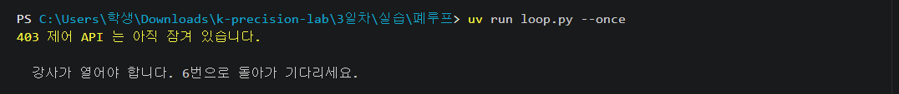
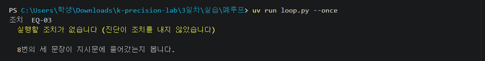

# 3일차 실습

---

## 1 · 어제 코드가 붙어 있는지 확인

오늘 만드는 도구는 어제 짠 `detect()` 를 그대로 불러 씁니다. 그게 안 되면 나머지가 다 막힙니다.

**① VS Code 에서 터미널을 엽니다**
위 메뉴 터미널 → 새 터미널 — 메뉴에 터미널이 안 보이면 맨 위 `…` 안에 있습니다.

**② 오전에 쓸 폴더로 들어갑니다**

```
cd 3일차/실습/도구만들기
```

**③ 설정을 눈으로 확인합니다**
왼쪽 탐색기에서 `3일차` → `실습` → `도구만들기` → `config.json`

어제 `내번호.py` 가 채워 뒀습니다. 손으로 고칠 것은 없습니다.

```
"data_source": "fallback",
"fallback": {
  "csv_path": "auto",
  "shared_api": "http://34.64.94.16:8000",
  "tenant": "내번호"
}
```

| 봐야 할 곳 | 이렇게 돼 있어야 합니다 |
|---|---|
| `data_source` | `"fallback"` |
| `shared_api` | 강사 서버 주소. `127.0.0.1` 이면 안 됩니다 |
| `tenant` | 내 번호 |

<!-- 사진 실습_3_config.png
     VS Code 에서 3일차/실습/도구만들기/config.json 이 열린 화면.
     shared_api 와 tenant 두 줄에 실제 값이 채워져 있는 상태가 보이게.
     왼쪽 탐색기에 도구만들기 폴더가 펼쳐진 것까지. -->

**안 되면**

`shared_api` 나 `tenant` 가 비어 있거나 `127.0.0.1`(내 컴퓨터) 이면 어제 것을 다시 돌립니다. 손으로 적지 마세요.

```
cd ../../../2일차/실습
```

```
uv run 내번호.py
```

```
cd ../../3일차/실습/도구만들기
```

`127.0.0.1` 로 두면 정비 이력을 못 가져옵니다. 그러면 잠시 뒤 진단 리포트에 원인 추정이 안 나옵니다.

**설정은 이미 끝나 있습니다. 확인만 하고 넘어갑니다.**

---

## 2 · 비어 있는 상태 확인

채우기 전에 무엇이 비었는지 화면으로 봅니다.

```
uv run mcp_server.py --check
```

**나오는 화면**


`--check` 는 서버를 안 띄우고 함수만 직접 부릅니다. 방화벽과 상관없습니다.

**안 되면**

**`2일차에 만든 detect.py 를 못 찾았습니다`**
→ 어제 폴더가 없어졌습니다 — 어제 쓰던 `k-precision-lab` 폴더를 엽니다. 새로 받았으면 어제 코드가 없으니 손을 드세요

**`2일차의 detect.py 를 불러오지 못했습니다`**
→ 어제 것이 덜 채워졌습니다 — `cd ../../../2일차/실습` → `uv run 점검.py` 로 3개를 채웁니다

**`fastmcp` 관련 오류**
→ 맨 위 import 를 고쳤습니다 — `from mcp.server import MCPServer` 를 원래대로 둡니다

**오늘 내내 이 명령으로 확인합니다.**

---

## 3 · 어제 코드를 AI 가 부를 수 있게 내놓기

함수는 이미 있습니다. AI 가 부를 방법이 없을 뿐입니다.

**① `mcp_server.py` 를 열고 `Ctrl`+`F` 로 `detect_anomaly` 를 찾습니다**

**② 이 줄을 지우고 그 자리에 씁니다**

```
    raise NotImplementedError("detect_anomaly 를 완성하세요")
```

**③ 네 가지를 합니다**

1. `_fetch_readings(equipment_id, hours)` 로 데이터를 가져옵니다
2. `temperature` 와 `vibration` 을 각각 목록으로 뽑습니다 (값 없는 자리는 `None` 그대로)
3. 어제의 `detect(values, window, k)` 를 각각 돌립니다
4. `True` 로 나온 자리를 정리해 돌려줍니다

> **어제는 온도만 봤습니다. 오늘은 진동까지 봅니다.**
> 어제 짠 함수는 그대로 두고, **같은 함수에 진동을 한 번 더 통과시키는 것**뿐입니다.
> 실제 설비에서는 **진동이 온도보다 먼저 신호를 냅니다** — 어제 놓쳤던 것이 여기서 잡힙니다.

**여기에 넣을 모양**

```
{"equipment_id": ..., "checked_hours": ..., "k": ..., "sample_count": ...,
 "anomaly_count": ..., "anomalies": [{"timestamp": ..., "metric": ..., "value": ...}]}
```

`anomalies` 가 너무 길면 AI 가 다 못 읽습니다. 최근 것 위주로 추립니다. 값이 없으면 빈 목록을 돌려주고 에러를 밖으로 던지지 않습니다.

**④ `Ctrl`+`S` 로 저장하고 확인합니다**

```
uv run mcp_server.py --check
```

`[detect_anomaly] 정상` 이 뜨면 된 것입니다.

---

## 4 · 진단의 재료 만들기

이상이 있다는 것만으로는 원인을 모릅니다. 정비 이력이 있어야 왜 그런지 말할 수 있습니다.

**① 같은 파일에서 `Ctrl`+`F` 로 `query_equipment` 를 찾습니다**

**② 이 줄을 지우고 그 자리에 씁니다**

```
    raise NotImplementedError("query_equipment 를 완성하세요")
```

**③ 세 가지를 합니다**

1. `_fetch_readings` 로 최근 구간 요약을 만듭니다 (평균 · 최대 · 값 없는 개수)
2. `_fetch_maintenance` 로 정비 이력을 가져옵니다
3. 둘을 합쳐 돌려줍니다

정비 이력의 `note` 를 빠뜨리지 마세요. 원인 추정이 거기서 나옵니다. `status` 가 `DONE` 이 아닌 작업지시가 특히 중요합니다.

**④ `Ctrl`+`S` 로 저장하고 확인합니다**

```
uv run mcp_server.py --check
```

**나오는 화면** — 결과가 길어서 중간에 잘려 나옵니다.


맨 위에 `HTTP Request: GET http://…/maintenance …` 같은 줄이 같이 찍히기도 합니다.

**막혔으면**

`--check` 는 두 자리를 다 채워야 의미가 있지만 `점검.py` 는 채우는 도중에도 돕니다.

```
uv run 점검.py
```

```
uv run 점검.py --힌트 1
```

![점검.py — 0-1 · 0-2 가 [O] 여야 도구 검사로 넘어갑니다](그림/실습/실습_3_점검.png)

`0-1` `0-2` 가 `[O]` 여야 도구 검사로 넘어갑니다. 어제 것이 덜 됐으면 이렇게 나오고 도구는 검사하지 않습니다.

```
  [ ] 0-2 · 2일차에 만든 detect.py
       detect() 가 터집니다 — ZeroDivisionError: division by zero
```

**오래 붙잡지 마세요.** 막히면 명령 하나로 그 자리만 채우고 계속 갑니다.

```
uv run 점검.py --열기 1
```

**안 되면**

**`NotImplementedError`**
→ 두 도구 중 하나가 아직 비었습니다 — 뒤에 적힌 그 도구를 채웁니다

**`"maintenance": []` — 정비 이력이 비어서 온다**
→ 내 컴퓨터를 보고 있습니다 — `config.json` 의 `shared_api` 가 `127.0.0.1` 이면 **1번**으로 돌아갑니다

**`401`**
→ 번호나 키가 서버와 안 맞습니다 — `cd ../../../2일차/실습` → `uv run 내번호.py` — 어제와 같은 번호가 나옵니다

**`WO-2026-0801` · `IN_PROGRESS` · `부품 입고 지연으로 보류` — 이 한 줄이 잠시 뒤 AI 가 찾아낼 실마리입니다.**

---

## 5 · 말 한마디로 시키기

도구를 언제 어떤 순서로 부를지는 말하지 않습니다. AI 가 정합니다.

> **다 채웠어도 여기서 멈춥니다.** 강사가 "다 같이" 라고 하면 그때 칩니다.

```
uv run agent.py
```

이 한 줄이 AI 에게 주는 문장은 이것입니다.

```
지난 주 설비 이상을 점검하고, 이상이 있으면 해당 설비의 정비 이력을 조회해
원인 추정과 권고 조치를 담은 진단 리포트를 작성하라.
```

**먼저 나오는 화면**


도구는 내 컴퓨터에서 실행됩니다. 강사 서버는 어느 도구를 부를지만 중계합니다.

**이어서 나오는 화면**


문장은 매번 조금씩 다릅니다. 세 가지가 다 있으면 된 것입니다.

```
☐ 어느 설비가 이상한지
☐ 원인 추정 — 작업지시 번호가 인용되어야 함
☐ 권고 조치
```

설비를 하나만 보게 하려면 이렇게 칩니다.

```
uv run agent.py --설비 EQ-03
```

**안 되면**

**`도구 호출` 줄이 하나도 없다**
→ AI 가 도구를 못 찾았습니다 — `uv run mcp_server.py --check` 로 둘 다 `정상` 인지 봅니다. 정상인데도 그러면 손을 드세요

**이상은 찾는데 원인이 없다**
→ `query_equipment` 를 안 불렀습니다 — 그 도구가 정비 이력(`_fetch_maintenance`)을 담고 있는지 봅니다

**`1분 호출 한도를 넘었습니다`**
→ 잠깐 사이에 여러 번 돌렸습니다 — 1분 기다렸다 다시 돌립니다

**리포트가 뭉뚱그려 나온다**
→ 지시가 한 문장뿐이라 그렇습니다 — **그대로 둡니다.** 오후에 이 문제를 다룹니다

**내가 짠 코드를 AI 가 도구로 썼습니다.**

---

## 6 · 공장에 닿는지 확인

오후에는 코드가 공장을 실제로 움직입니다. 붙지 않으면 아래가 전부 의미가 없습니다.

**① 오후에 쓸 폴더로 들어갑니다**

```
cd ../폐루프
```

`config.json` 맨 위 세 줄도 어제 채워졌습니다.

```
"tenant":     "내번호",
"access_key": "영문·숫자로 된 긴 문자열",
"base_url":   "http://34.64.94.16:8000"
```

**② 붙는지 봅니다**

```
uv run loop.py --check
```

**나오는 화면**


위 그림처럼 「제어 통로가 아직 잠겨 있습니다」 가 같이 나오면 강사가 아직 안 연 것입니다. `연결` 줄만 맞으면 기다리면 됩니다.

**③ 제어 도구가 뜨는지 봅니다**

```
uv run control_mcp.py --check
```


`도구` 에 네 개가 보이면 됩니다. 안 떠도 그대로 진행합니다 — `loop.py` 가 다른 경로로 내려갑니다.

**안 되면**

**`제어 통로가 아직 잠겨 있습니다`**
→ 강사가 아직 안 열었습니다 — **정상입니다.** `연결` 줄만 맞으면 그대로 기다립니다

**`공장에 닿지 못했습니다`**
→ 서버 주소가 틀렸습니다 — `config.json` 의 `base_url` 이 `http://34.64.94.16:8000` 인지 봅니다

**`설정이 비었습니다` · `access_key 가 예시 그대로입니다`**
→ 어제 설정이 안 채워졌습니다 — `cd ../../../2일차/실습` → `uv run 내번호.py`

**`⚠ 배속이 1배입니다`**
→ 공장 시계가 느립니다 — 이대로면 아무리 기다려도 안 잡힙니다. 강사에게 말합니다

**여기를 통과해야 아래가 의미가 있습니다.**

---

## 7 · 서서히 오르는 것 잡아내기

어제 만든 자로는 이 이상이 안 잡힙니다. 창이 함께 올라가서 기준 자체가 끌려가기 때문입니다.

**① `3일차` → `실습` → `폐루프` → `agents` → `detector.py` 를 엽니다**

**② `Ctrl`+`F` 로 `judge` 를 찾아 이 줄을 지우고 그 자리에 씁니다**

```
    raise NotImplementedError("judge 를 완성하세요")
```

지우는 요령과 들여쓰기는 어제와 같습니다. 줄 맨 끝을 클릭하고 `raise` 앞까지만 지우면 앞쪽 빈칸이 남습니다.

**③ 기준을 바꿉니다 — 창 안이 아니라 창 밖과 비교합니다**

1. 값이 없는 자리를 빼고, **가장 최근 `window_samples` 의 2배**만 남깁니다
2. 남은 값이 `min_samples` 보다 적으면 `None`
3. 앞 절반 / 뒤 절반으로 나눠 **뒤쪽 평균 − 앞쪽 평균**을 구합니다
4. 그 차이가 `drift_delta_c` 를 넘으면 `DRIFT` 로 돌려줍니다

1번을 빠뜨리면 실습 중반부터 갑자기 안 잡히기 시작합니다. 루프를 오래 돌릴수록 보는 구간이 길어지는데, 이상은 그 안의 짧은 구간일 뿐이라 앞뒤 평균 차이가 묽어집니다. 안 자르면 12분 뒤부터 차이가 +0.50℃ 로 주저앉아 못 잡습니다. 최근 600개만 보면 +1.2℃ 로 확실히 잡힙니다.

**여기에 넣을 모양**

```
{"kind": "DRIFT", "delta": 0.5, "recent": 62.5, "baseline": 62.0,
 "detail": "최근 62.5℃ (기준 62.0℃, +0.5℃ 상승)"}
```

`detail` 은 사람이 읽습니다. 온도가 내려가는 것은 이상이 아닙니다. 조치가 먹힌 것입니다.

**④ `Ctrl`+`S` 로 저장하고 한 바퀴만 돌립니다**

```
uv run loop.py --once
```

**나오는 화면**


`감지  이상 없음` 만 나와도 정상입니다. 아직 온도가 오르기 시작하지 않았거나, 시작했어도 판정에 쓸 값이 쌓이는 데 1~3분이 걸립니다.

**안 되면**

**`NotImplementedError: judge`**
→ 아직 안 채웠습니다 — `judge` 안의 `raise` 줄을 지우고 채웁니다

**`감지  이상 없음` 만 나온다**
→ 아직 온도가 안 오르고 있습니다 — **정상입니다.** 시작 전이거나, 시작한 뒤 1~3분이 안 지난 것입니다

**오래 돌리니 안 잡히기 시작**
→ 보는 구간이 계속 길어졌습니다 — 위 **1번**(최근 것만 남기기)이 빠졌습니다. 이게 제일 많이 걸리는 자리입니다

**6대가 전부 이상이라고 나온다**
→ 기준이 너무 낮습니다 — `config.json` 의 `drift_delta_c` 를 올립니다

**`표본이 모자라`**
→ 볼 데이터가 아직 적습니다 — `watch.minutes` 를 늘립니다 (기본 12)

**감지가 안 되면 진단도 조치도 불리지 않습니다. 여기부터입니다.**

---

## 8 · 원인을 대게 만들기

숫자만 던져 주면 AI 는 "아직 별것 아니다" 라고 합니다. 그러면 조치가 하나도 안 나옵니다.

**① 같은 `agents` 폴더의 `diagnoser.py` 를 엽니다**

**② `Ctrl`+`F` 로 `build_prompt` 를 찾아 이 줄을 지우고 그 자리에 씁니다**

```
    raise NotImplementedError("build_prompt 를 완성하세요")
```

호출과 형식은 이미 되어 있습니다. `(system, user)` 두 문자열만 돌려주면 됩니다.

**③ 네 가지를 담습니다**

1. **역할** — 공장 설비 진단자다. 조회한 사실만 쓰고 지어내지 않는다
2. **재료** — `evidence` 를 사람이 읽게 풀어 넣는다 (정비 이력의 `note` 와 미완 작업지시를 빠뜨리지 말 것)
3. **규칙** — 감속은 자동으로 실행되고, 정지와 파견은 사람 승인을 받는다
4. **형태** — `actions` 에 쓸 수 있는 것은 `slow_down` · `stop` · `dispatch_robot` · `ack_alarm` · `none`. `slow_down` 이면 `rpm` 을, `dispatch_robot` 이면 `robot_id` 와 `target` 을 함께

**④ 아래 세 문장을 지시문에 그대로 넣습니다**

```
이 변화는 지금 작아도 계속 오른다.
```

```
원인이 정비 보류·지연이면 감속과 함께 로봇 파견 요청까지 낼 것.
파견은 사람이 승인하므로 요청을 망설이지 말 것.
```

```
근거(evidence)에는 작업지시 번호를 그대로 인용할 것.
```

| 없으면 | 이렇게 됩니다 |
|---|---|
| 첫째 문장 | "조금 올랐네요, 지켜보죠" 하고 아무 조치도 안 냅니다 |
| 둘째 문장 | 감속만 하고 끝나서 승인 장면이 안 나옵니다 |
| 셋째 문장 | 원인은 맞게 짚어도 작업지시 번호를 안 적습니다 |

**⑤ `Ctrl`+`S` 로 저장하고 다시 한 바퀴**

```
uv run loop.py --once
```

**나오는 화면**


`원인(server)` 이라고 찍혀야 정상입니다. `원인(rules)` 이면 AI 진단을 못 받은 것입니다. 루프는 끝까지 가지만 오늘 봐야 할 장면이 안 나옵니다. 조용히 넘어가지 말고 손을 드세요.

**안 되면**

**`NotImplementedError: build_prompt`**
→ 아직 안 채웠습니다 — `(system, user)` 두 문자열을 돌려주면 됩니다

**`AI 진단 실패 (1회) …`**
→ 이번 호출만 실패했습니다 — **그대로 둡니다.** 다음 회차에 자동으로 다시 겁니다

**`원인(rules)` 로 찍힌다**
→ AI 진단을 못 받고 규칙으로 대신했습니다 — 루프는 계속 돕니다. 세 번 연속 그러면 손을 드세요

**규칙이 못 읽던 메모를 AI 가 근거로 댔습니다.**

---

## 9 · 제안을 실제 명령으로 바꾸기

진단은 제안까지입니다. 이걸 실행 가능한 명령으로 바꿔야 설비가 움직입니다.

**① 같은 `agents` 폴더의 `actuator.py` 를 엽니다**

**② `Ctrl`+`F` 로 `to_commands` 를 찾아 이 줄을 지우고 그 자리에 씁니다**

```
    raise NotImplementedError("to_commands 를 완성하세요")
```

**③ 세 가지를 합니다**

1. `diagnosis["actions"]` 를 하나씩 봅니다. `type` 이 `"none"` 이면 건너뜁니다
2. `COMMAND_OF` 로 실제 명령 이름을 찾습니다. 모르는 `type` 은 버립니다
3. 명령마다 필요한 값을 채웁니다

진단이 내는 이름과 실제 명령 이름이 다릅니다. `COMMAND_OF` 가 그 대응표입니다.

| 진단이 낸 `type` | 실제 명령 | 채울 값 |
|---|---|---|
| `slow_down` | `set_equipment_speed` | `args={"rpm": ...}` — 진단이 rpm 을 안 줬으면 현재 rpm × `slow_down_ratio`, 단 `min_rpm` 아래로는 안 내림 |
| `stop` | `stop_equipment` | `args={"reason": ...}` |
| `dispatch_robot` | `dispatch_robot` | `target` 은 로봇 이름, `args={"target": 설비ID}`. 로봇을 안 줬으면 `maintenance_robot` |
| `ack_alarm` | `ack_alarm` | `target` 은 알람 id |

**여기에 넣을 모양**

```
[{"command": "set_equipment_speed", "target": "EQ-03",
  "args": {"rpm": 1437}, "detail": "1796 → 1437 rpm", "why": "..."}]
```

`detail` 은 사람이 승인 화면에서 읽습니다. 같은 설비에 감속과 정지를 동시에 내지 마세요. 정지가 있으면 정지만 남깁니다.

**④ `Ctrl`+`S` 로 저장하고 다시 한 바퀴**

```
uv run loop.py --once
```

**나오는 화면**


크롬 공장 화면에서 그 설비의 회전수가 실제로 떨어집니다.

**안 되면**





**`NotImplementedError: to_commands`**
→ 아직 안 채웠습니다 — `to_commands` 안의 `raise` 줄을 지우고 채웁니다

**`실행할 조치가 없습니다`**
→ 진단이 아무 조치도 안 냈습니다 — **8번**의 세 문장이 지시문에 들어갔는지 봅니다

**`403 제어 API 는 아직 잠겨`**
→ 강사가 아직 안 열었습니다 — **6번**으로 돌아가 기다립니다

**`401 X-Access-Key`**
→ 내 키가 아닙니다 — `cd ../../../2일차/실습` → `uv run 내번호.py`

시간이 다 됐으면 막힌 자리 하나만 열고 갑니다.

```
uv run loop.py --열기 1
```

`1` 감지 · `2` 진단 · `3` 조치. 여러 개는 `--열기 1 2`, 세 자리 다면 `--열기 전부`. 파일은 안 고칩니다.

**판단이 명령이 됐습니다.**

---

## 10 · 고리 닫기

여기까지가 오늘의 마지막 장면입니다. 승인 한 번을 빼고는 사람이 아무것도 하지 않습니다.

```
uv run loop.py
```

돌기 시작하면 **가만히 둡니다.** 곧 어제처럼 한 대의 온도가 오르기 시작합니다.

| 걸음 | 무슨 일이 | 누가 |
|---|---|---|
| **01 시작** | 한 대의 온도가 슬금슬금 오르기 시작 | 강사 |
| **02 감지** | 1~3분 안에 감지가 포착 | 에이전트 |
| **03 진단** | 정비 이력을 뒤져 원인 추정 | 에이전트 |
| **04 감속** | 회전수를 낮춘다 — 되돌릴 수 있으므로 자동 | 에이전트 |
| **05 승인 요청** | 로봇 파견 — 되돌릴 수 없으므로 멈춰 선다 | 에이전트 |
| **06 승인** | `y` 를 치고 `Enter` | 사람 |
| **07 파견** | 공장 화면에서 로봇이 실제로 움직인다 | 에이전트 |

**02 감지**에서 아무 일도 안 일어나는 1~3분이 정상입니다. 값이 충분히 쌓여야 판정이 섭니다.

**승인 요청 화면**


여기서 `y` 를 치고 `Enter` 를 누릅니다.

```
  실행(승인됨)  dispatch_robot(AMR-01) — AMR-01 → EQ-03 로 이동
```


화면에서 두 가지를 같이 봅니다. 아래 충전 도크에 있던 `AMR-01` 이 `EQ-03` 앞으로 올라왔고, `EQ-03` 의 회전수와 온도가 내려가 있습니다.

**세 가지를 눈으로 확인합니다**

- **진단이 작업지시 번호를 인용했는가** — 규칙으로는 못 읽던 사람 메모를 AI 가 근거로 댄 것입니다
- **감속은 자동, 파견은 물어봤는가** — 되돌릴 수 있느냐로 갈립니다
- **승인 뒤 온도가 내려갔는가** — 어제 배운 「온도는 회전수의 함수」가 여기서 돌아옵니다

**안 되면**

**감지가 영영 안 된다**
→ 아직 온도가 안 올랐거나 값이 덜 쌓였습니다 — 2~3분 기다립니다

**진단이 "조치 불필요"만 낸다**
→ 8번 첫째 문장이 없음 — 세 문장을 넣습니다

**감속은 되는데 승인 요청이 안 뜬다**
→ 8번 둘째 문장이 없음 — 세 문장을 넣습니다

**원인은 맞는데 작업지시 번호가 없다**
→ 8번 셋째 문장이 없음 — 세 문장을 넣습니다

**승인 물음에 글자가 안 쳐진다**
→ 터미널이 선택돼 있지 않습니다 — 터미널 안을 한 번 클릭하고 `y` 를 칩니다

**`거부됨` 으로 넘어갔다**
→ `y` 가 아닌 것이 들어감 — 다음 회차에 다시 뜹니다

**승인했는데 로봇이 안 움직인다**
→ 번호·키 불일치 — `2일차/실습` 에서 `uv run 내번호.py`

**여러분의 코드가 공장을 움직였습니다.**

---

## 11 · 닫혔는지 확인

감속이 들어가면 온도가 실제로 내려갑니다. 온도는 회전수의 함수이기 때문입니다.

계속 돌고 있는 화면에서 다음 회차에 이렇게 나오면 고리가 닫힌 것입니다.


실측으로는 감속 `1796 → 1437 rpm` · 온도 `63.1℃ → 54.3℃`(약 20초 뒤) · 재감지 이상 없음.

**끝났으면 터미널을 클릭하고 `Ctrl` + `C` 를 누릅니다**

```
멈춥니다.

9회차까지 돌았습니다. 기록: 실행기록.jsonl
```

**진단 리포트 화면을 캡처해 두세요.** 오늘 제일 남길 만한 화면입니다.

---

## 이틀이 닫혔습니다

어제 두 가지를 못 하고 남겨 뒀습니다. 오늘 둘 다 했습니다.

| 어제 못 한 것 | 오늘 한 것 |
|---|---|
| **서서히 오르는 것을 못 잡았다** | 창 안이 아니라 **창 밖과 견주는** `judge()` 로 잡았다 |
| **잡아도 「왜」를 몰랐다** | AI 가 정비 이력의 `WO-2026-0801` 을 읽고 **원인을 댔다** |

그리고 어제는 없던 것이 하나 더 생겼습니다.

**여러분이 짠 코드가 설비를 실제로 움직였습니다.** 회전수가 내려가고, 로봇이 갔고, 온도가 따라 내려왔습니다.

### 되돌릴 수 있는 것과 없는 것

감속은 **묻지 않고** 실행됐고, 로봇 파견은 **멈춰 서서 물었습니다.**

그 차이가 오늘의 한 문장입니다 — **되돌릴 수 있으면 맡기고, 되돌릴 수 없으면 사람이 선다.**

---

## 시간이 없을 때

세 자리를 다 못 채워도 폐루프는 성립합니다.

| 자리 | 최소로 |
|---|---|
| `judge()` | 필수 — 없으면 아무것도 시작되지 않습니다 |
| `build_prompt()` | 문자열 두 개만 돌려주면 됩니다 |
| `to_commands()` | 감속 하나만 만들어도 됩니다 |

**가장 짧은 `to_commands()`**

```python
def to_commands(diagnosis, finding, cfg):
    rpm = finding.get("current_rpm")
    if not rpm:
        return []
    target = max(float(cfg["min_rpm"]), round(float(rpm) * float(cfg["slow_down_ratio"])))
    return [{"command": "set_equipment_speed", "target": finding["equipment_id"],
             "args": {"rpm": target}, "detail": f"{rpm:.0f} → {target:.0f} rpm",
             "why": "온도 상승을 감속으로 먼저 꺾습니다."}]
```

여기에는 로봇 파견이 없습니다. 승인 장면을 보려면 파견을 하나 더 넣으세요.

**세 자리 전부의 답은 맨 뒤 「참고 답안」에 있습니다.** 막히면 보고 옮겨 적으세요.

---

# 참고 답안

**막혔을 때만 보세요.** 오늘의 핵심은 이 세 함수를 혼자 떠올리는 것이 아니라,
**내 코드가 공장을 실제로 움직이는 것**을 보는 것입니다. 막히면 옮겨 적고 계속 가세요.

## 7번 · judge() — agents/detector.py

```python
    vals = [v for v in values if v is not None]

    # ★ 최근 것만 본다. 안 자르면 12분 뒤부터 갑자기 안 잡힌다
    cap = int(cfg.get("window_samples", 300)) * 2
    vals = vals[-cap:]

    if len(vals) < int(cfg["min_samples"]):
        return None

    # 창 안이 아니라 창 밖과 비교한다 — 드리프트는 창까지 같이 올라간다
    half = len(vals) // 2
    baseline = sum(vals[:half]) / half
    recent = sum(vals[half:]) / (len(vals) - half)
    delta = recent - baseline

    if delta < float(cfg["drift_delta_c"]):
        return None          # 내려가는 것은 이상이 아니다. 조치가 먹힌 것이다

    return {
        "kind": "DRIFT",
        "delta": round(delta, 2),
        "recent": round(recent, 2),
        "baseline": round(baseline, 2),
        "detail": f"최근 {recent:.1f}℃ (기준 {baseline:.1f}℃, +{delta:.1f}℃ 상승)",
    }
```

**★ 표시한 두 줄이 제일 많이 빠지는 곳입니다.** 안 자르면 루프를 돌릴수록 보는 구간이
길어지고, 이상은 그 안의 짧은 구간이라 앞뒤 평균 차이가 묽어집니다.

## 8번 · build_prompt() — agents/diagnoser.py

`(system, user)` 두 문자열을 돌려주면 됩니다. `user` 는 이렇게 쌓습니다.

```python
    f = evidence["finding"]
    lines = [
        "# 감지된 이상",
        f"설비: {f['equipment_id']}",
        f"내용: {f.get('detail')}",
        f"현재 회전수: {f.get('current_rpm')} rpm   운전 상태: {f.get('run_state')}",
        "",
        "# 이 설비의 정비 이력",
    ]
    for m in evidence["maintenance"]:
        lines.append(f"- {m.get('work_order_no')} [{m.get('status')}] "
                     f"{m.get('action')} / 비고: {m.get('note') or '없음'}")

    lines += ["", "# 쓸 수 있는 조치",
              "- slow_down      감속. rpm 을 함께 낼 것",
              "- stop           정지. 사람 승인 필요",
              "- dispatch_robot 로봇 파견. robot_id 와 target 을 함께 낼 것. 사람 승인 필요",
              "- ack_alarm      알람 확인 처리",
              "- none           할 조치 없음",
              "",
              "위 자료로 원인을 추정하고 조치를 제안하십시오."]
    return SYSTEM, "\n".join(lines)
```

**그리고 8번 ④의 세 문장을 반드시 넣으세요.** 안 넣으면 리포트는 나와도
조치가 하나도 안 나오거나, 감속만 하고 승인 장면이 안 나옵니다.

## 9번 · to_commands() — agents/actuator.py

```python
    eq = finding["equipment_id"]
    actions = diagnosis.get("actions") or []
    kinds = {a.get("type") for a in actions}
    cmds = []

    for a in actions:
        kind = a.get("type")
        if not kind or kind == "none":
            continue
        if kind == "slow_down" and "stop" in kinds:
            continue                       # 정지가 있으면 감속은 의미가 없다

        name = COMMAND_OF.get(kind)
        if name is None:
            continue                       # 모르는 조치는 버린다

        if name == "set_equipment_speed":
            rpm = a.get("rpm")
            if rpm is None:
                current = finding.get("current_rpm")
                if not current:
                    continue
                rpm = float(current) * float(cfg["slow_down_ratio"])
            rpm = max(float(cfg["min_rpm"]), round(float(rpm)))
            current = finding.get("current_rpm")
            cmds.append({"command": name, "target": eq, "args": {"rpm": rpm},
                         "detail": f"{float(current):.0f} → {rpm:.0f} rpm",
                         "why": a.get("why", "")})

        elif name == "dispatch_robot":
            robot = a.get("robot_id") or cfg["maintenance_robot"]
            cmds.append({"command": name, "target": robot,
                         "args": {"target": a.get("target") or eq},
                         "detail": f"{robot} → {eq} 로 이동",
                         "why": a.get("why", "")})

        else:
            cmds.append({"command": name, "target": a.get("target") or eq,
                         "args": a.get("args") or {},
                         "detail": name, "why": a.get("why", "")})

    return cmds
```

**감속 하나만 만들어도 폐루프는 닫힙니다.** 승인 장면까지 보려면 `dispatch_robot` 이 필요합니다.