# 3일차 실습

---

## 1 · 어제 것이 그대로 있는지 봅니다

오늘 만드는 도구는 어제 짠 `detect()` 를 그대로 불러 씁니다.
이게 안 되면 오늘 전부가 막히니, 먼저 확인부터 합니다.

**① VS Code 에서 터미널을 엽니다**
위 메뉴 터미널 → 새 터미널 — 메뉴에 터미널이 안 보이면 맨 위 `…` 안에 있습니다.

**② 오전에 쓸 폴더로 들어갑니다**

```
cd 3일차/실습/도구만들기
```

**③ 설정을 눈으로 확인합니다**
왼쪽 탐색기에서 `3일차` → `실습` → `도구만들기` → `config.json`

어제 `내번호.py` 가 채워 뒀습니다. 손으로 고칠 것은 없습니다.

```json
"data_source": "fallback",
"fallback": {
  "csv_path": "auto",
  "shared_api": "http://34.64.94.16:8000",
  "tenant": "내번호"
}
```

| 봐야 할 곳 | 이렇게 돼 있어야 합니다 |
|---|---|
| `data_source` | `"fallback"` |
| `shared_api` | `http://34.64.94.16:8000` 으로 돼 있어야 합니다 |
| `tenant` | 내 번호 |


---

## 2 · 도구는 아직 비어 있습니다

채우기 전에 무엇이 비었는지 화면으로 봅니다.

```
uv run mcp_server.py --확인
```

**나오는 화면**

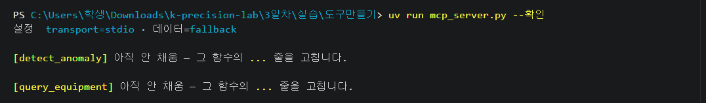

`--확인` 은 서버를 안 띄우고 함수만 직접 부릅니다. 방화벽과 상관없습니다.

---

## 3 · 감시자를 AI 의 도구로 내놓습니다

감시자는 이미 있습니다. AI 가 그것을 **부를 방법**이 없을 뿐입니다.

**① `mcp_server.py` 를 열고 `Ctrl`+`F` 로 `빈칸` 을 칩니다**

**뼈대는 이미 다 있습니다.** 고칠 것은 `...` 이라고 적힌 두 줄뿐입니다.

| 빈칸 | 고칠 줄 | 하는 일 |
|---|---|---|
| 1 | `values = ...` | 이 항목의 값만 순서대로 뽑는다 |
| 2 | `플래그 = ...` | **★ 어제 짠 `detect()` 를 여기서 부른다** |

> **어제 짠 함수를 한 줄도 안 고치고 그대로 씁니다.**
> 온도와 진동에 각각 한 번씩 통과시키는 것도 어제 `돌려보기.py` 가 하던 그대로입니다.
> 오늘 달라지는 것은 **누가 그 함수를 부르느냐** 하나뿐입니다.

**여기에 넣을 모양**

```모양
{"equipment_id": ..., "checked_hours": ..., "k": ..., "sample_count": ...,
 "anomaly_count": ..., "anomalies": [{"timestamp": ..., "metric": ..., "value": ...}]}
```

`anomalies` 가 너무 길면 AI 가 다 못 읽습니다. 최근 것 위주로 추립니다.
값이 없으면 빈 목록을 돌려주고 에러를 밖으로 던지지 않습니다.

**어디까지 남길지는 여러분이 정합니다.** 잠시 뒤 AI 리포트에 무엇이 실리는지가 이 한 줄에서 갈립니다.

**② `Ctrl`+`S` 로 저장하고 확인합니다**

```
uv run mcp_server.py --확인
```

`[detect_anomaly] 정상` 이 뜨면 된 것입니다.


**막히면 정답을 넣고 갑니다**

```
uv run 확인.py --정답 1
```

그 자리에만 정답이 들어가고, 나머지는 내가 쓴 것 그대로 남습니다.

---

## 4 · 진단의 재료를 만듭니다

이상이 있다는 것만으로는 원인을 모릅니다. 정비 이력이 있어야 왜 그런지 말할 수 있습니다.

**① 같은 파일에서 `빈칸 3` · `빈칸 4` 를 찾습니다**

| 빈칸 | 고칠 줄 | 하는 일 |
|---|---|---|
| 3 | `"note": ...` | **★ 정비 메모. 원인 추정이 여기서 나온다** |
| 4 | `미완 = ...` | 아직 안 끝난 작업지시만 추린다 → `open_work_orders` 로 나갑니다 |

`note` 를 빠뜨리면 잠시 뒤 AI 리포트가 **「원인 불명」으로 끝납니다.**
`status` 가 `DONE` 이 아닌 작업지시가 오늘의 실마리입니다.

**② `Ctrl`+`S` 로 저장하고 확인합니다**

```
uv run mcp_server.py --확인
```

**나오는 화면** — 결과가 길어서 중간에 잘려 나옵니다.

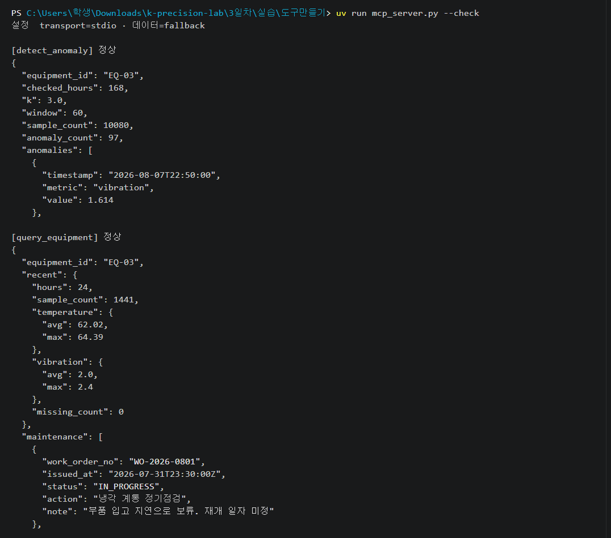

맨 위에 `HTTP Request: GET http://…/maintenance …` 같은 줄이 같이 찍히기도 합니다.

**막혔으면**

`--확인` 은 네 자리를 다 채워야 의미가 있지만 `확인.py` 는 채우는 도중에도 돕니다.

```
uv run 확인.py
```

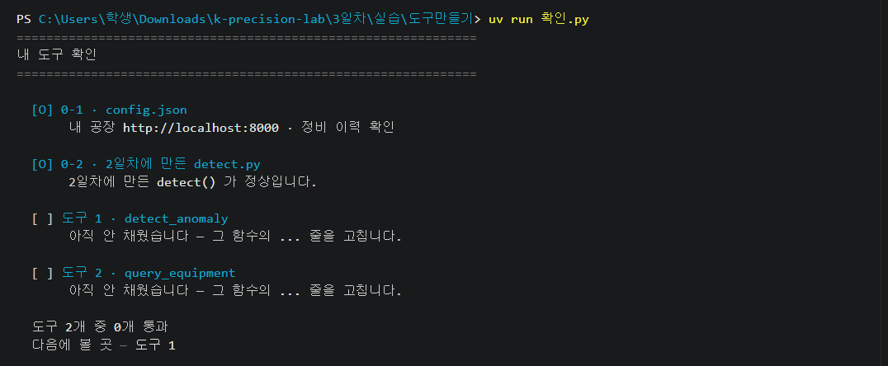

`0-1` `0-2` 가 `[O]` 여야 도구 검사로 넘어갑니다. 어제 것이 덜 됐으면 이렇게 나오고 도구는 검사하지 않습니다.

```
  [ ] 0-2 · 2일차에 만든 detect.py
       detect() 가 터집니다 — ZeroDivisionError: division by zero
```

**막히면 정답을 넣고 갑니다**

```
uv run 확인.py --정답 2
```

그 자리에만 정답이 들어가고, 나머지는 내가 쓴 것 그대로 남습니다.

---

## 5 · 말 한마디로 시킵니다

도구를 언제 어떤 순서로 부를지는 말하지 않습니다. AI 가 정합니다.

다 채웠으면 강사 신호에 맞춰 **다 같이** 돌립니다 — 첫 장면을 같이 보기 위해서입니다.

```
uv run agent.py
```

이 한 줄이 AI 에게 주는 문장은 이것입니다.

```지시문
지난 주 설비 이상을 점검하고, 이상이 있으면 해당 설비의 정비 이력을 조회해
원인 추정과 권고 조치를 담은 진단 리포트를 작성하라.
```

**먼저 나오는 화면**

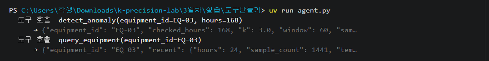

도구는 내 컴퓨터에서 실행됩니다. 강사 서버는 어느 도구를 부를지만 중계합니다.

**이어서 나오는 화면**

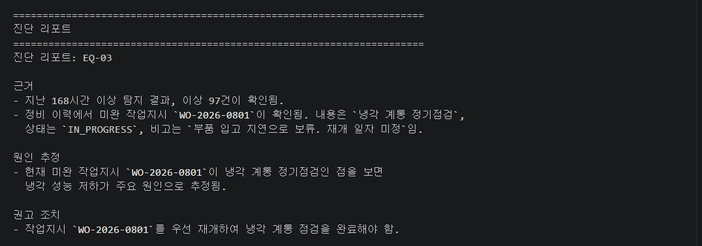

문장은 매번 조금씩 다릅니다. 세 가지가 다 있으면 된 것입니다.

```
☐ 어느 설비가 이상한지
☐ 원인 추정 — 작업지시 번호가 인용되어야 함
☐ 권고 조치
```

설비를 하나만 보게 하려면 이렇게 칩니다.

```
uv run agent.py --설비 EQ-03
```

---

## 6 · 공장에 닿는지 확인합니다

여기까지는 어제 받은 **7일치 기록**을 읽었습니다. 이제부터는 **지금 이 순간 도는 공장**입니다.
코드가 그 공장을 실제로 움직입니다. 붙지 않으면 아래가 전부 의미가 없습니다.

**① 오후에 쓸 폴더로 들어갑니다**

```
cd ../폐루프
```

`config.json` 맨 위 세 줄도 어제 채워졌습니다.

```json
"tenant":     "내번호",
"access_key": "영문·숫자로 된 긴 문자열",
"base_url":   "http://34.64.94.16:8000"
```

**② 붙는지 봅니다**

```
uv run loop.py --확인
```

**나오는 화면**

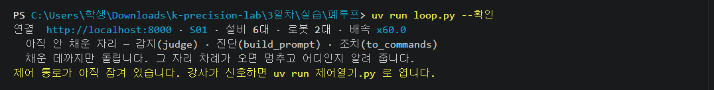

위 그림처럼 「제어 통로가 아직 잠겨 있습니다」 가 같이 나오면 강사가 아직 안 연 것입니다. `연결` 줄만 맞으면 기다리면 됩니다.

**③ 제어 도구가 뜨는지 봅니다**

```
uv run control_mcp.py --확인
```

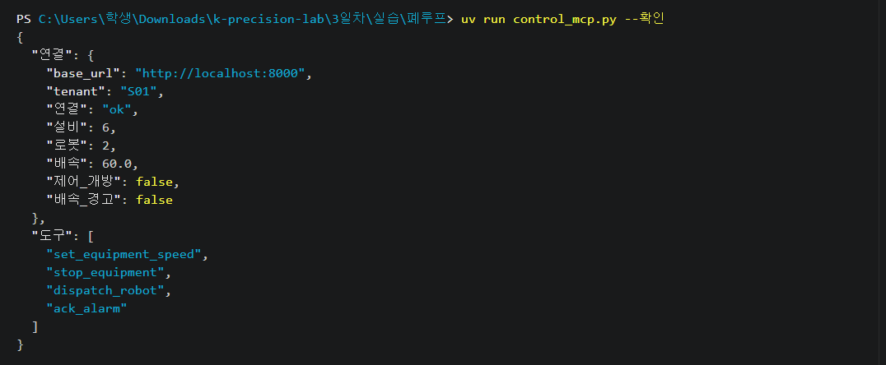

`도구` 에 네 개가 보이면 됩니다. 안 떠도 걱정할 것 없습니다 — `loop.py` 는 이것 없이도 돕니다.

---

## 7 · 서서히 오르는 것을 잡습니다

어제 만든 감시자로는 이 이상이 안 잡힙니다.
온도가 천천히 오르면 감시자의 「평소」도 같이 따라 올라가기 때문입니다.

**① `3일차` → `실습` → `폐루프` → `agents` → `detector.py` 를 엽니다**

**② `Ctrl`+`F` 로 `빈칸` 을 칩니다**

| 빈칸 | 고칠 줄 | 하는 일 |
|---|---|---|
| 1 | `cap = ...` · `vals = ...` | **★ 최근 것만 남긴다** |
| 2 | `baseline = ...` · `recent = ...` | 앞 절반 평균 · 뒤 절반 평균 |

그래서 오늘은 **보는 구간을 반으로 갈라, 앞쪽(과거)을 기준으로** 삼습니다.
기준이 과거에 묶여 있으니 더는 따라 올라가지 못합니다.

`빈칸 1`(최근 것만 남기기)을 빠뜨리면 **조치가 먹혀 온도가 내려간 뒤에도 계속 이상이라고 웁니다.**
지나간 이상이 보는 구간에 남아 있기 때문입니다. 실제로 재 보면, 자르면 **+1.2℃** 로
또렷하게 잡히고 끝나면 조용해지는데 — 안 자르면 **+0.5℃** 로 흐린 채 끝나고도 계속 울렸습니다.

**여기에 넣을 모양**

```모양
{"kind": "DRIFT", "delta": 0.5, "recent": 62.5, "baseline": 62.0,
 "detail": "최근 62.5℃ (기준 62.0℃, +0.5℃ 상승)"}
```

`detail` 은 사람이 읽습니다. 온도가 내려가는 것은 이상이 아닙니다. 조치가 먹힌 것입니다.

**③ `Ctrl`+`S` 로 저장하고 한 바퀴만 돌립니다**

```
uv run loop.py --once
```

**나오는 화면**

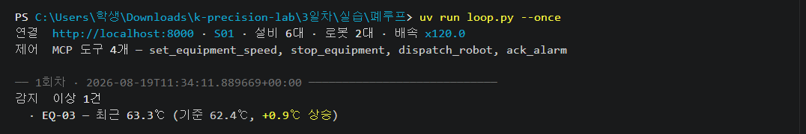

`감지  이상 없음` 만 나와도 정상입니다. 아직 온도가 오르기 시작하지 않았거나, 시작했어도 판정에 쓸 값이 쌓이는 데 1~3분이 걸립니다.


**막히면 정답을 넣고 갑니다**

```
uv run loop.py --정답 1
```

감지 자리에만 정답이 들어가고, 나머지는 내가 쓴 것 그대로 남습니다.

---

## 8 · 원인을 대게 만듭니다

숫자만 던져 주면 AI 는 "아직 별것 아니다" 라고 합니다. 그러면 조치가 하나도 안 나옵니다.

**① 같은 `agents` 폴더의 `diagnoser.py` 를 엽니다**

**② `빈칸 3` 의 `system = ...` 을 고칩니다**

**여기가 오늘의 진짜 실습입니다.** 자료를 사람이 읽게 푸는 부분은 이미 다 돼 있고,
여러분이 쓰는 것은 **AI 에게 주는 지시문** 하나입니다.

지시문에는 이것부터 넣습니다 — 공장 설비 진단자다, **조회한 사실만 쓰고 지어내지 않는다.**

**③ 그리고 아래 세 덩이를 반드시 넣습니다** (둘째 덩이는 두 줄입니다)

여러 줄로 쓰려면 따옴표 세 개로 감쌉니다.

```지시문
이 변화는 지금 작아도 계속 오른다.
```

```지시문
원인이 정비 보류·지연이면 감속과 함께 로봇 파견 요청까지 낼 것.
파견은 사람이 승인하므로 요청을 망설이지 말 것.
```

```지시문
근거(evidence)에는 작업지시 번호를 그대로 인용할 것.
```

| 없으면 | 이렇게 됩니다 |
|---|---|
| 첫째 덩이 | "조금 올랐네요, 지켜보죠" 하고 아무 조치도 안 냅니다 |
| 둘째 덩이 | 감속만 하고 끝나서 승인 장면이 안 나옵니다 |
| 셋째 덩이 | 원인은 맞게 짚어도 작업지시 번호를 안 적습니다 |

**④ `Ctrl`+`S` 로 저장하고 다시 한 바퀴**

```
uv run loop.py --once
```

**나오는 화면**

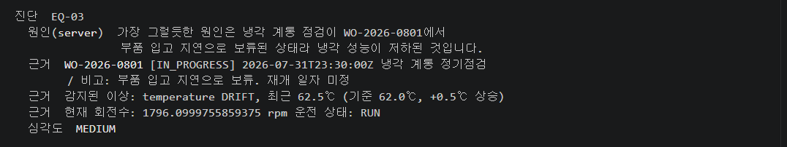

`원인(server)` 이라고 찍혀야 정상입니다. `원인(rules)` 이면 AI 진단을 못 받은 것입니다. 루프는 끝까지 가지만 오늘 봐야 할 장면이 안 나옵니다. 조용히 넘어가지 말고 손을 드세요.


**막히면 정답을 넣고 갑니다**

```
uv run loop.py --정답 2
```

진단 자리에만 정답이 들어가고, 나머지는 내가 쓴 것 그대로 남습니다.

---

## 9 · 제안을 실제 명령으로 바꿉니다

진단은 제안까지입니다. 이걸 실행 가능한 명령으로 바꿔야 설비가 움직입니다.

**① 같은 `agents` 폴더의 `actuator.py` 를 엽니다**

**② `빈칸 4` · `빈칸 5` 를 찾습니다**

| 빈칸 | 고칠 줄 | 하는 일 |
|---|---|---|
| 4 | `name = ...` | 진단이 낸 이름을 **실제 명령 이름**으로 바꾼다 |
| 5 | `rpm = ...` | 진단이 rpm 을 안 줬을 때 얼마로 낮출까 |

진단이 내는 이름과 실제 명령 이름이 다릅니다. `COMMAND_OF` 가 그 대응표입니다.

| 진단이 낸 `type` | 실제 명령 | 채울 값 |
|---|---|---|
| `slow_down` | `set_equipment_speed` | `args={"rpm": ...}` — 진단이 rpm 을 안 줬으면 현재 rpm × `slow_down_ratio`, 단 `min_rpm` 아래로는 안 내림 |
| `stop` | `stop_equipment` | `args={"reason": ...}` |
| `dispatch_robot` | `dispatch_robot` | `target` 은 로봇 이름, `args={"target": 설비ID}`. 로봇을 안 줬으면 `maintenance_robot` |
| `ack_alarm` | `ack_alarm` | `target` 은 알람 id |

**여기에 넣을 모양**

```모양
[{"command": "set_equipment_speed", "target": "EQ-03",
  "args": {"rpm": 1437}, "detail": "1796 → 1437 rpm", "why": "..."}]
```

`detail` 은 사람이 승인 화면에서 읽습니다. 같은 설비에 감속과 정지를 같이 내지 않습니다 — 정지가 있으면 정지만 남깁니다.

**③ `Ctrl`+`S` 로 저장하고 다시 한 바퀴**

```
uv run loop.py --once
```

**나오는 화면**


크롬 공장 화면에서 그 설비의 회전수가 실제로 떨어집니다.


**막히면 정답을 넣고 갑니다**

```
uv run loop.py --정답 3
```

조치 자리에만 정답이 들어가고, 나머지는 내가 쓴 것 그대로 남습니다.

---

## 10 · 고리를 닫습니다

여기까지가 오늘의 마지막 장면입니다. 승인 한 번을 빼고는 사람이 아무것도 하지 않습니다.

```
uv run loop.py
```

돌기 시작하면 **가만히 둡니다.** 곧 어제처럼 한 대의 온도가 오르기 시작합니다.

| 걸음 | 무슨 일이 | 누가 |
|---|---|---|
| **01 시작** | 한 대의 온도가 슬금슬금 오르기 시작 | 강사 |
| **02 감지** | 1~3분 안에 감지가 포착 | 에이전트 |
| **03 진단** | 정비 이력을 뒤져 원인 추정 | 에이전트 |
| **04 감속** | 회전수를 낮춘다 — 되돌릴 수 있으므로 자동 | 에이전트 |
| **05 승인 요청** | 로봇 파견 — 되돌릴 수 없으므로 멈춰 선다 | 에이전트 |
| **06 승인** | `y` 를 치고 `Enter` | 사람 |
| **07 파견** | 공장 화면에서 로봇이 실제로 움직인다 | 에이전트 |

**02 감지**에서 아무 일도 안 일어나는 1~3분이 정상입니다. 값이 충분히 쌓여야 판정이 섭니다.

**승인 요청 화면**

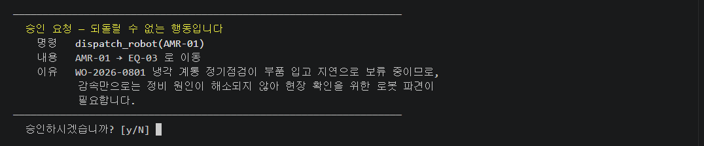

여기서 `y` 를 치고 `Enter` 를 누릅니다.

```
  실행(승인됨)  dispatch_robot(AMR-01) — AMR-01 → EQ-03 로 이동
```

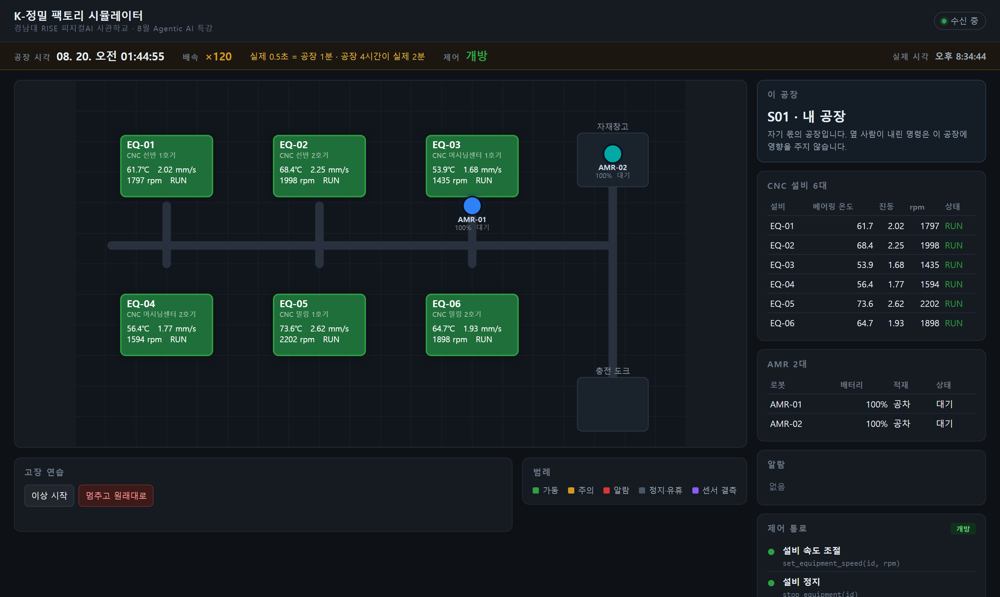

화면에서 두 가지를 같이 봅니다. 아래 충전 도크에 있던 `AMR-01` 이 `EQ-03` 앞으로 올라왔고, `EQ-03` 의 회전수와 온도가 내려가 있습니다.

**세 가지를 눈으로 확인합니다**

- **진단이 작업지시 번호를 인용했는가** — 규칙으로는 못 읽던 사람 메모를 AI 가 근거로 댄 것입니다
- **감속은 자동, 파견은 물어봤는가** — 되돌릴 수 있느냐로 갈립니다
- **승인 뒤 온도가 내려갔는가** — 어제 배운 「온도는 회전수의 함수」가 여기서 돌아옵니다

---

## 11 · 닫혔는지 확인합니다

감속이 들어가면 온도가 실제로 내려갑니다. 온도는 회전수의 함수이기 때문입니다.

계속 돌고 있는 화면에서 다음 회차에 이렇게 나오면 고리가 닫힌 것입니다.

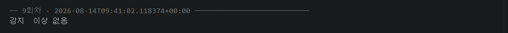

실측으로는 감속 `1796 → 1437 rpm` · 온도 `63.1℃ → 54.3℃`(약 20초 뒤) · 재감지 이상 없음.

**끝났으면 터미널을 클릭하고 `Ctrl` + `C` 를 누릅니다**

```
멈춥니다.

9회차까지 돌았습니다. 기록: 실행기록.jsonl
```

**이 진단 리포트가 오늘 제일 남길 만한 화면입니다.**

---

## 이틀이 닫혔습니다

어제 두 가지를 못 하고 남겨 뒀습니다. 오늘 둘 다 했습니다.

| 어제 못 한 것 | 오늘 한 것 |
|---|---|
| **서서히 오르는 것을 못 잡았다** | **기준을 과거에 고정한** `judge()` 로 잡았다 |
| **잡아도 「왜」를 몰랐다** | AI 가 정비 이력의 `WO-2026-0801` 을 읽고 **원인을 댔다** |

그리고 어제는 없던 것이 하나 더 생겼습니다.

**여러분이 짠 코드가 설비를 실제로 움직였습니다.** 회전수가 내려가고, 로봇이 갔고, 온도가 따라 내려왔습니다.

### 되돌릴 수 있는 것과 없는 것

감속은 **묻지 않고** 실행됐고, 로봇 파견은 **멈춰 서서 물었습니다.**

그 차이가 오늘의 한 문장입니다 — **되돌릴 수 있으면 맡기고, 되돌릴 수 없으면 사람이 선다.**

---

## 시간이 없을 때

세 자리를 다 못 채워도 폐루프는 성립합니다.

| 자리 | 최소로 |
|---|---|
| `judge()` | 필수 — 없으면 아무것도 시작되지 않습니다 |
| `build_prompt()` | 문자열 두 개만 돌려주면 됩니다 |
| `to_commands()` | 감속 하나만 만들어도 됩니다 |

막힌 자리는 `uv run loop.py --정답 1` 로 채웁니다 — `1` 감지 · `2` 진단 · `3` 조치.
**오늘 볼 장면 — 여러분의 코드가 공장을 움직이는 것 — 까지 갑니다.**
