# 경남대 RISE 피지컬AI 사관학교 — 8월 AI 특강 실습 환경 준비

일곱 가지를 차례로 합니다. **⑦번의 공장 화면이 뜨면 끝**입니다.
각 단계 첫 줄에 그게 무엇인지 한 줄로 적어 두었습니다.

---

## ① 노션(Notion) 계정 (3분)

**배운 걸 적어 두는 노트입니다.** 종이 대신 웹에 쌓이고, 나중에 검색해서
꺼내 볼 수 있습니다. 그래서 쌓일수록 **내 자산**이 됩니다.

이틀 동안 배운 것을 여기에 적고, **마지막에 그 링크를 내는 것이 수료 조건**입니다.
첫날 1교시가 이걸 쓰는 법을 익히는 시간입니다.

1. https://www.notion.so 에서 **가입** (구글 계정으로 하면 빠릅니다)
2. 로그인해서 왼쪽에 사이드바가 보이면 성공입니다

**무료 계정으로 충분합니다.** 한국어로 쓰려면 오른쪽 아래 설정에서 언어를 한국어로 바꾸세요.

## ② VS Code 설치 (3분)

**코드를 쓰는 프로그램입니다.** 문서를 한글이나 워드로 쓰듯, 코드는 이걸로 씁니다.
아래쪽에 **명령을 치는 칸**이 같이 붙어 있어서, 코드를 고치는 것도 돌리는 것도
이 창 하나에서 다 합니다. 이틀 동안 이 화면을 제일 많이 보게 됩니다.

https://code.visualstudio.com 에서 **Download for Windows** 를 눌러 받고 실행합니다.
**전부 기본값 그대로 두고 넘어가면 됩니다.** 화면 순서는 이렇습니다.

**1. 사용권 계약** — 기본이 「동의하지 않습니다」입니다. **「동의합니다」로 바꿔야** 다음으로 넘어갑니다.

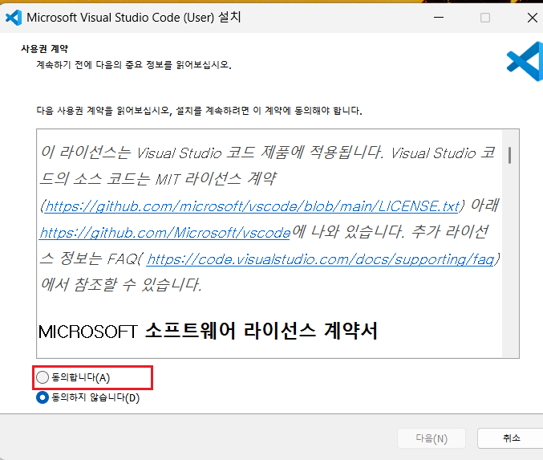

**2. 설치 위치 · 시작 메뉴** — 그대로 두고 다음.

**3. 추가 작업 선택** — **아무것도 바꾸지 마세요.** 「PATH에 추가」가 이미 체크돼 있습니다.

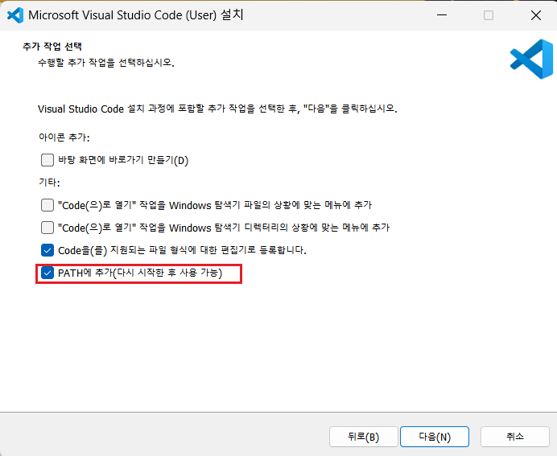

**4. 설치 준비 완료** — 목록에 「PATH에 추가」가 있는지 눈으로 확인하고 **설치**를 누릅니다.

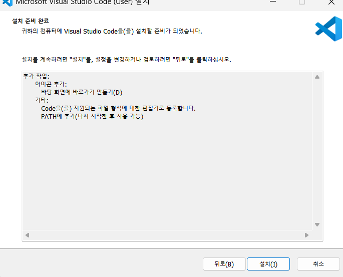

**5. 완료** — 「Visual Studio Code 실행」이 체크된 채로 **종료**를 누르면 VS Code 가 열립니다.

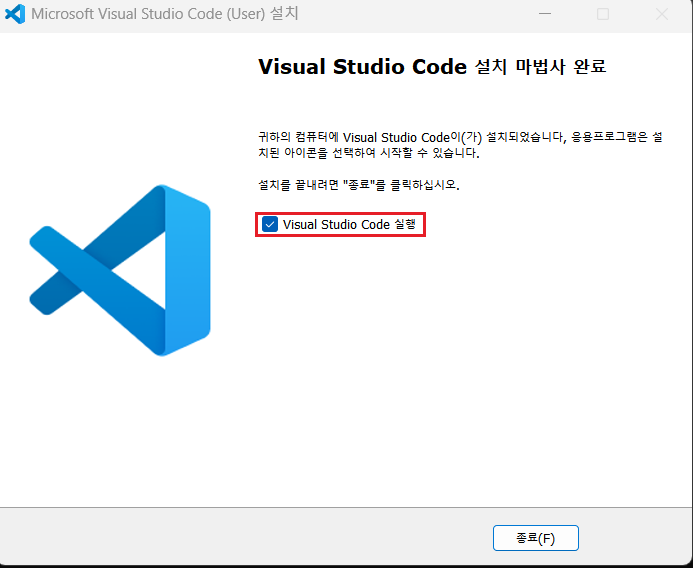

## ③ 실습 파일 받기 (3분)

**이틀 동안 만질 코드와 데이터입니다.** 코드는 뼈대까지 짜여 있고 **중요한 줄만
비어 있습니다** — 그 빈칸을 채우는 것이 실습입니다. 데이터는 기계 여섯 대가
일주일 동안 남긴 **센서 기록 6만 줄**입니다.

1. 아래 드라이브 폴더에서 **`k-precision-lab.zip`** 을 내려받습니다 (약 1MB)

   https://drive.google.com/drive/folders/1WsQmwnfv21qAbAb79X1BS95djSz0Vvti?usp=sharing

2. **압축을 풉니다.** 위치는 어디든 상관없습니다 (바탕화면 · 다운로드 폴더 등)

3. VS Code 를 실행하고 가운데 **「폴더 열기」** 를 누릅니다.

   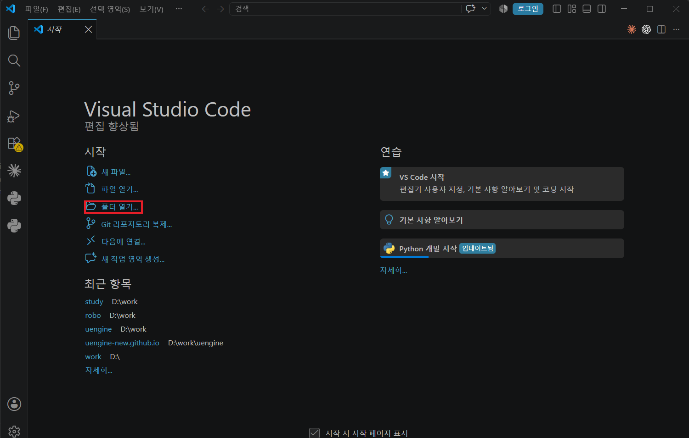

4. 압축을 푼 **`k-precision-lab` 폴더를 한 번 클릭**하고 오른쪽 아래 **「폴더 선택」** 을 누릅니다.
   **폴더 안으로 들어가지 마세요.** 폴더를 한 번만 클릭한 상태로 「폴더 선택」입니다.

   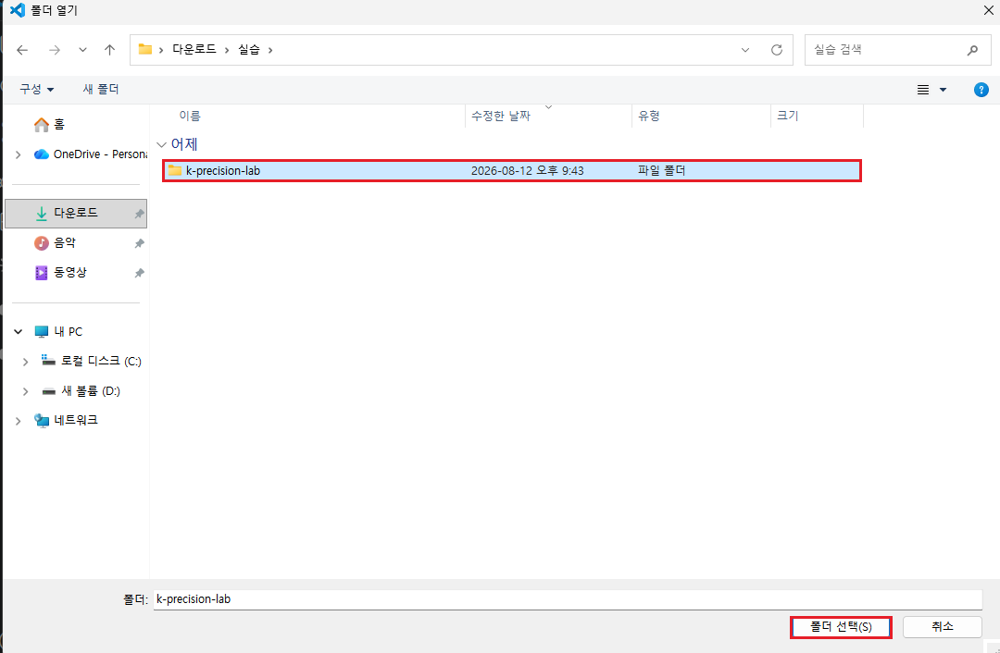

5. 왼쪽 목록에 **`2일차` `3일차` `공장` `데이터`** 네 폴더가 있으면 성공입니다.
   그 위아래로 다른 것이 몇 개 더 보이는 것은 정상입니다.

   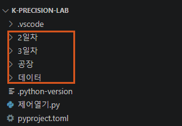

> **압축을 꼭 풀어서 쓰세요.** ZIP 안에서 바로 열면 코드가 안 돌아갑니다.
> 「폴더 선택」을 눌렀는데 왼쪽에 저 넷이 안 보이면, 한 단계 위나 아래 폴더를 고른 것입니다.
>
> **반드시 「폴더」로 여세요.** 파일 하나만 끌어다 열면 실습 설정이 적용되지 않아
> 다음 단계에서 막힙니다.

## ④ uv 설치하고 한 번 돌려 보기 (5분)

**파이썬을 대신 챙겨 주는 도구입니다.** 실습 코드는 파이썬으로 돌아가는데,
원래는 파이썬을 깔고 버전을 맞추고 필요한 것들을 하나씩 더 받아야 합니다.
그 일을 uv 가 대신 합니다 — **파이썬을 따로 깔 필요가 없고**, `uv run` 으로
돌리면 없는 것은 그때 알아서 받아 옵니다.

**③에서 연 VS Code 안에서** 합니다. 창을 따로 열 필요 없습니다.

**1. 터미널을 엽니다** — 위 메뉴 **터미널 → 새 터미널** (또는 `Ctrl` + `` ` ``)

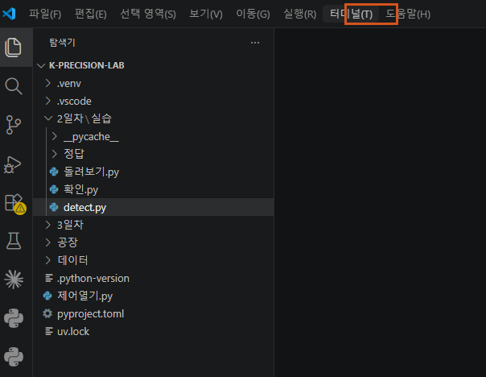

> 창이 좁으면 **터미널** 메뉴가 `...` 안으로 접힙니다. `...` 를 누르면
> 그 안에 있습니다.

창 아래쪽에 이런 칸이 생깁니다. **앞으로 치는 것은 전부 이 칸에 칩니다.**

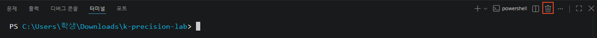

**2. 실습에 쓸 `uv` 를 깝니다** — 아래 한 줄을 그 칸에 붙여넣고 Enter.

```
powershell -ExecutionPolicy ByPass -c "irm https://astral.sh/uv/install.ps1 | iex"
```

치고 나면 그 자리에서 이렇게 이어집니다. 맨 아래 **`everything's installed!`**
가 나오면 된 것입니다.

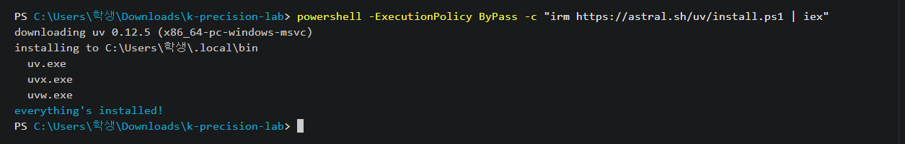

**3. 터미널을 닫고 새로 엽니다** — 방금 깐 것을 인식시키려면 필요합니다.
터미널 칸 **오른쪽 끝 휴지통 아이콘**을 눌러 닫고, 다시 **터미널 → 새 터미널**.

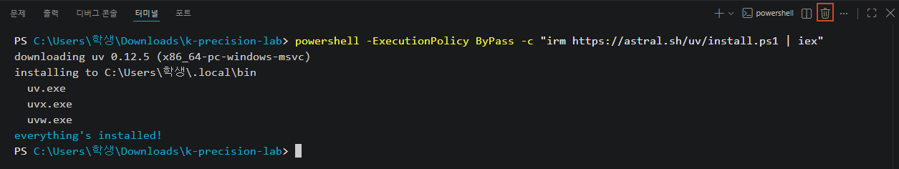

**4. 실습이 돌아가는지 확인합니다** — 새로 연 칸에 아래 두 줄을 붙여넣고 Enter.

```
cd 2일차/실습
uv run 확인.py
```

**처음 한 번은 조금 기다립니다** — 파이썬과 라이브러리를 이때 내려받습니다.
아래처럼 점검 결과가 뜨면 성공입니다.
아직 아무것도 안 채웠으니 **`[ ]` 표시가 나오는 것이 정상**입니다.

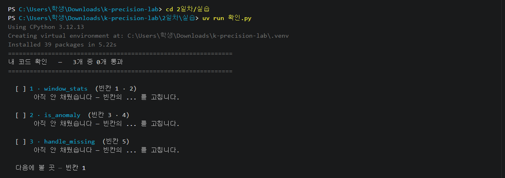

## ⑤ WSL 설치

**윈도우 안에 리눅스를 하나 더 넣는 것입니다.** 리눅스는 서버에서 많이 쓰는
운영체제인데, 다음 ⑥ 에서 깔 **Docker 가 그 위에서만 돌아갑니다.**
그래서 Docker 보다 먼저 깝니다. 리눅스를 직접 쓸 일은 없습니다.

**1. 관리자 PowerShell 을 엽니다** — 윈도우 검색창에 **powershell** 을 치고,
**Windows PowerShell** 위에서 **오른쪽 클릭 → 「관리자 권한으로 실행」**.

**2. 한 줄을 칩니다** — 검은 창이 열리면 아래를 붙여넣고 Enter.

```
wsl --install
```

WSL 과 Ubuntu 를 차례로 내려받아 깝니다.

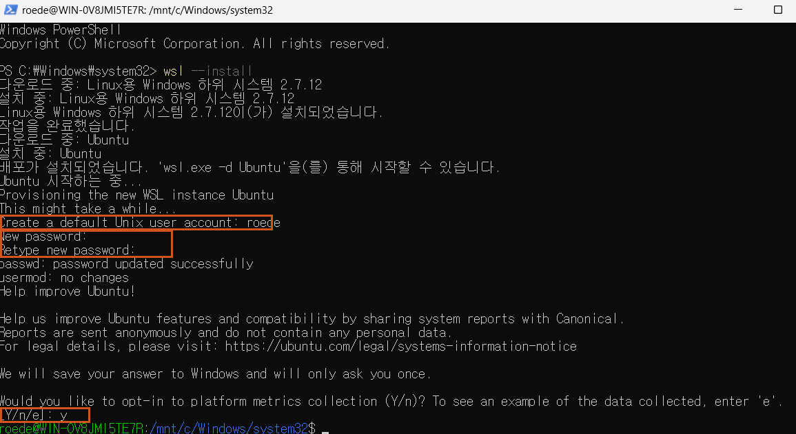

**중간에 세 가지를 물어봅니다.**

| 물어보는 것 | 이렇게 하세요 |
|---|---|
| `Create a default Unix user account` | 이름은 **그대로 두고** Enter |
| `New password` · `Retype new password` | **`1234`** 을 두 번. **쳐도 화면에 아무것도 안 보이는 것이 정상**입니다 |
| 긴 영어 질문 끝에 `[Y/n/e]` | `y` 를 치고 Enter |

> **평소 쓰는 암호는 넣지 마세요.** 이 암호는 그 컴퓨터 안 Ubuntu 에서만
> 쓰고 윈도우 로그인과 아무 관계가 없습니다. 실습에서 다시 칠 일도 없으니
> `1234` 로 두면 됩니다.

**3. 컴퓨터를 다시 시작합니다** — 세 가지에 다 답했으면 WSL 은 끝났습니다.
창을 닫고 **다시 시작**하세요. 이걸 건너뛰면 ⑥ 에서 Docker 가 안 켜집니다.

## ⑥ Docker Desktop 설치

**프로그램을 통째로 포장해서 받아 돌리는 도구입니다.** ⑦ 에서 켤 가상 공장은
서버와 데이터베이스로 되어 있는데, 그걸 하나씩 깔고 맞추는 대신 **포장된 채로
받아 명령 한 줄로 켭니다.** 망가지면 지우고 다시 받으면 그만이라, 마음껏
만져도 됩니다. ⑤ 에서 깐 WSL 위에 올립니다.

**1. 내려받습니다** — https://www.docker.com/products/docker-desktop
에서 **Download Docker Desktop** 을 누르면 목록이 펼쳐집니다.
**Download for Windows – AMD64** 를 고릅니다.

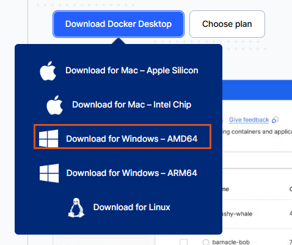

**2. 받은 파일을 실행합니다** — Configuration 화면이 나오면 **아무것도 바꾸지
말고 OK**. 이미 골라져 있는 것이 ⑤ 에서 켠 WSL 위에서 도는 방식입니다.

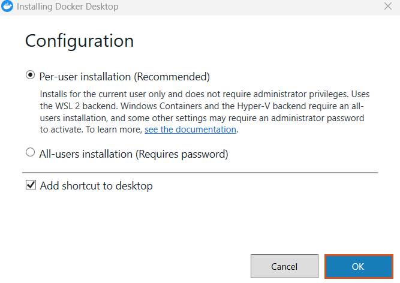

> **「Use WSL 2 instead of Hyper-V」** 선택지가 보이면 —
> **선택된 상태로 두고 OK** 하면 됩니다.

파일이 풀리는 동안 기다립니다.

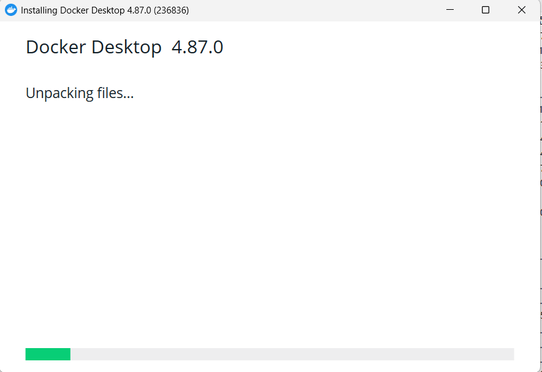

**Installation succeeded** 가 뜨면 **Close** 를 누릅니다.

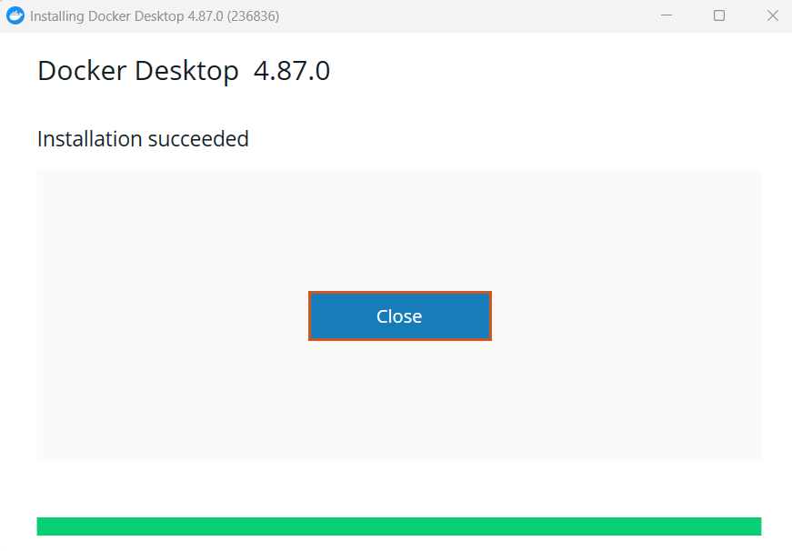

**3. Docker Desktop 을 실행합니다** — 바탕화면의 Docker Desktop 아이콘을
엽니다.

**「WSL not installed」 창이 뜨면 — 여기서 멈춥니다.** 오른쪽 아래 **Quit** 을
누르고, **⑤ 를 하고 컴퓨터를 다시 시작**한 다음 오세요. 창에 적힌 그대로입니다
— 다시 시작하고 나서 켜면 이 창 없이 넘어갑니다.

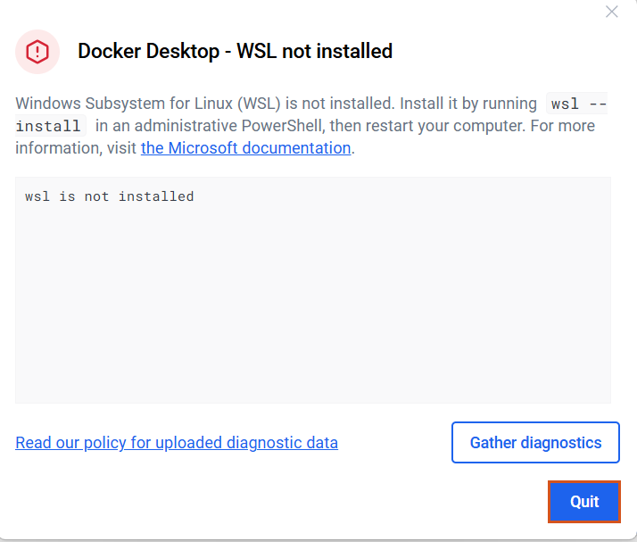

경고가 없거나, 다시 시작하고 왔으면 — 약관 화면에서 **Accept**.

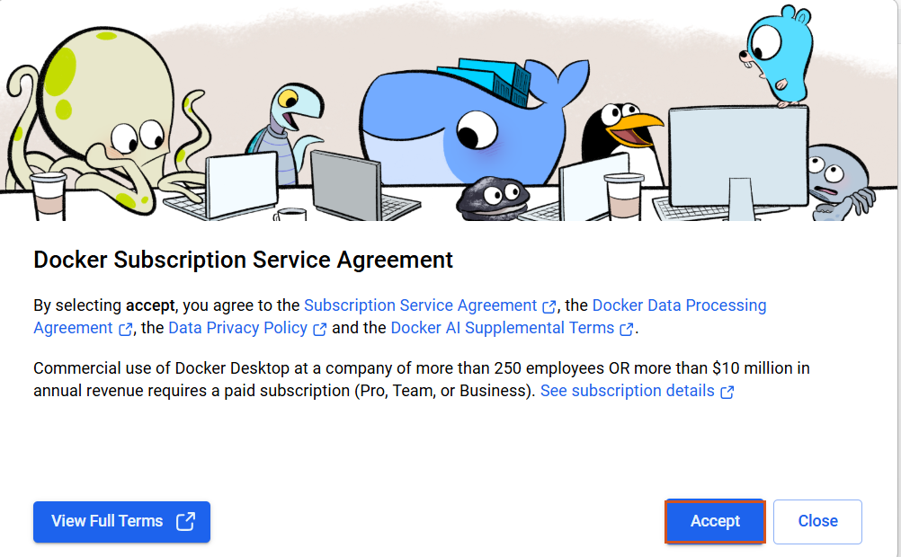

다음은 로그인(Welcome to Docker) 화면 — 계정은 필요 없습니다.
**오른쪽 위 Skip** 을 누릅니다.

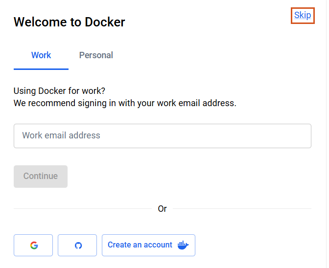

**4. WSL2 로 도는지 눈으로 확인합니다** — 위쪽 막대의 **톱니(설정) 아이콘**을
누릅니다.


**General** 화면의 「Choose how to run Docker containers」에서
**WSL2 가 골라져 있는지**만 봅니다. 골라져 있으면 바꿀 것이 없으니
**설정 창만 닫습니다.** Docker Desktop 은 켜 둔 채로 다음으로 갑니다.

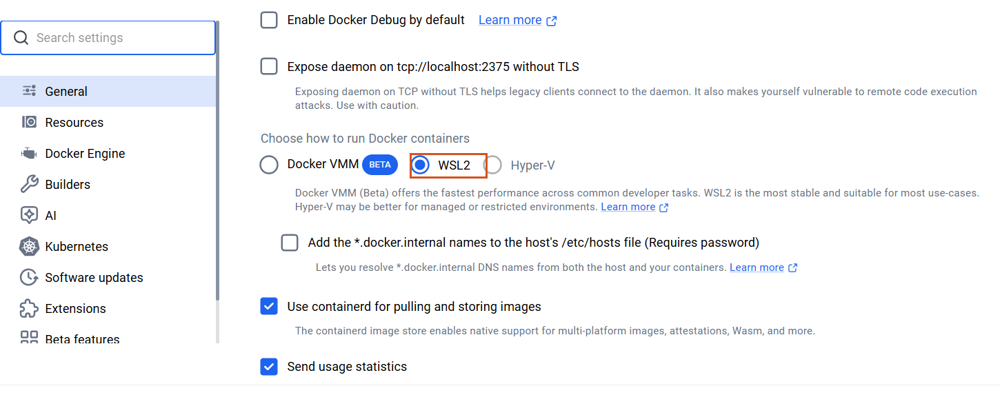

> 같은 자리가 **「Use WSL 2 based engine」** 이라는 이름으로 보이는
> 컴퓨터도 있습니다. **켜져 있으면 같은 상태**이니 그대로 두면 됩니다.

> **「Starting the Docker Engine…」 에서 몇 분째 돌기만 하면** —
> **컴퓨터를 다시 시작**하고 Docker Desktop 을 다시 켜세요. WSL 을 깐 뒤
> 다시 시작하지 않으면 여기서 붙잡힙니다.

## ⑦ 공장 켜 보기

**진짜 공장 대신 컴퓨터 안에서 돌아가는 공장입니다.** 기계 여섯 대와 운반 로봇
두 대가 실제로 돌면서 **온도·진동·회전수를 1분마다** 뱉어내고, 그게 브라우저
화면에 그대로 보입니다. 이틀 동안 이 값들을 보며 이상을 잡아내고, 3일차에는
여러분이 짠 코드가 **이 기계를 실제로 감속시키고 로봇을 부릅니다.**

**1. 공장을 켭니다** — ③에서 연 VS Code 터미널에서 아래 두 줄.

```
cd 공장
docker compose up -d
```

**처음 한 번은 공장 부품 약 700MB 를 내려받습니다** — 회선이 빠르면 1분이
안 걸리고, 느리면 그만큼 더 걸립니다. 글자가 죽 지나간 뒤 조용해지면 켜진
것입니다. **다음부터는 10초면 켜집니다.**

**2. 공장을 눈으로 봅니다** — 크롬 주소창에 아래를 붙여넣습니다.

```주소
http://localhost:8000
```

초록 네모 여섯 개가 있는 공장 화면이 뜨면 **준비 완료**입니다.

> 공장은 꺼도 됩니다 — 컴퓨터를 끄면 같이 멈추고, 수업 날
> `docker compose up -d` 한 줄이면 다시 켜집니다.

### Docker 가 안 켜지면

에러 창에 어떤 말이 있는지만 보세요.

| 화면에 있는 말 | 하실 일 |
|---|---|
| `WSL` | PowerShell 에 `wsl --update` 를 치고 Docker Desktop 을 다시 켭니다 |
| `virtualization` · 가상화 | BIOS 에서 가상화를 켜야 하는 경우입니다. 해 본 적 없으면 그냥 두세요 |

**해도 안 되면 그대로 오세요.** 회사 노트북처럼 권한이 없어 설치 자체가
안 되는 경우도 마찬가지입니다. 코딩 실습은 Docker 없이 전부 할 수 있고,
공장 화면만 옆자리와 같이 보면 됩니다.

### 잘 안 되면 — 「환경 점검」을 먼저 돌리세요

**잘못하신 것이 아닙니다.** 무엇이 어긋났는지부터 봅니다. 칠 것은 없습니다.

위 메뉴 **터미널 → 작업 실행** → **환경 점검** 을 고르면 세 줄이 나옵니다.

```
C:\Users\...\k-precision-lab                     ← 지금 있는 폴더
C:\Users\...\.local\bin\uv.exe                   ← uv 가 있는 자리
uv 0.11.21 ...                                   ← uv 버전
```

**위에서부터 읽습니다.**

| 이렇게 나오면 | 무엇이 어긋났나 | 하실 일 |
|---|---|---|
| 첫 줄이 `k-precision-lab` 이 아니다 | 다른 곳에서 터미널을 켰습니다 | **파일 → 폴더 열기**로 `k-precision-lab` **폴더를** 여세요 (파일 하나만 열면 안 됩니다) |
| 둘째 줄에 「찾을 수 없습니다」 | 창이 uv 자리를 아직 모릅니다 | **VS Code 를 완전히 껐다가 다시 켜세요** |
| 세 줄이 다 나온다 | 환경은 정상입니다 | 명령을 오타 없이 다시 쳐 보세요 |
