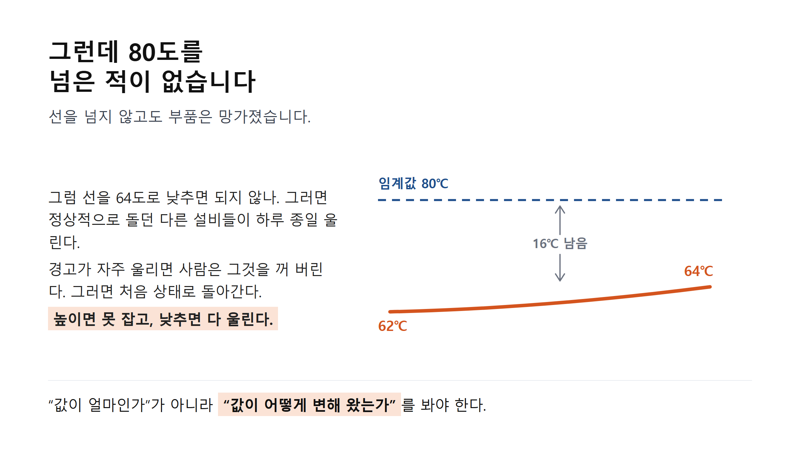
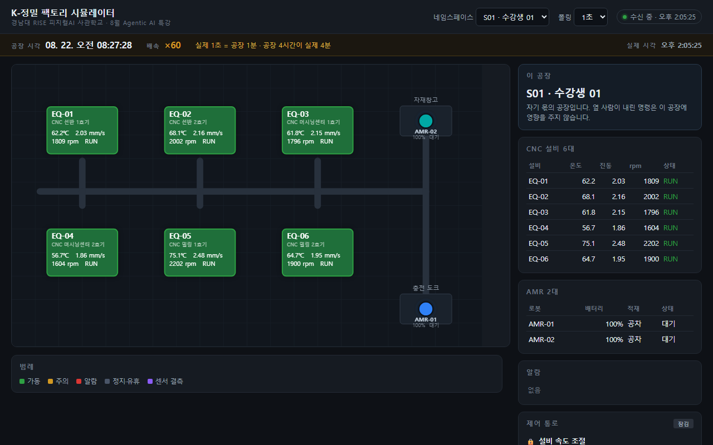
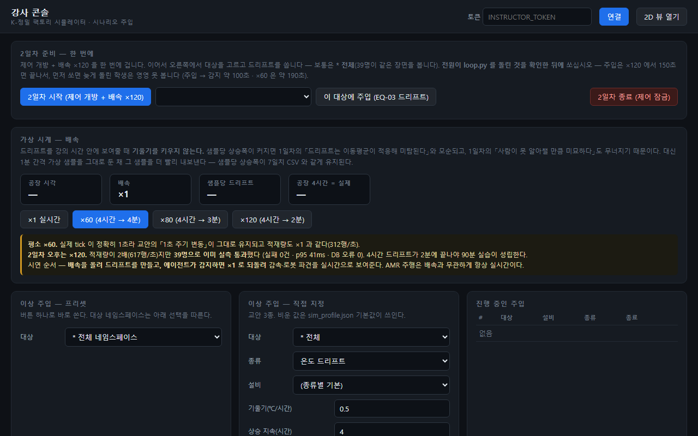

# 교육 실라버스 · 2일차·3일차 (각 4시간)

## 피지컬 AI 시대의 이상감지와 Agentic 제어

— 규칙이 못 잡는 것을, AI가 판단하고 설비를 움직이기까지 —

**내가 짠 알고리즘을 AI의 도구로 내놓고, 판단을 위임하되 경계를 긋는다**

총 8시간 (2일 × 240분) · 진행 방식: **전원 개인 실습** · 준비물: 개인 노트북(Python · VS Code · 노션 계정)

> **이 문서는 1일차를 맡으신 분께 드리는 것입니다.** 1일차 마지막에 뒤 이틀을
> 예고하시려면 흐름을 아셔야 해서, 1일차 실라버스와 같은 형식으로 정리했습니다.
> 맨 뒤에 **1일차 마무리에 그대로 쓰실 세 문장**과 **저희 산출물·접속 정보**를 붙였습니다.

---

# 1. 과정 개요

이틀은 하나의 이야기입니다. **2일차에 학생이 직접 짠 알고리즘이 벽에 부딪히고,
3일차에 그 벽을 AI로 넘습니다.** 두 날을 따로 떼면 성립하지 않습니다.

1일차가 *"의도를 명세로 바꿔 AI를 지휘한다"* 였다면, 이틀은 그 명세가
**실제로 도는 물리 설비**에 닿았을 때 무엇이 달라지는지를 다룹니다.
화면 속 소프트웨어와 달리, 여기서는 **판단이 틀리면 기계가 잘못 움직입니다.**

## 과정 콘셉트

> **"AI에게 판단을 맡기되, 되돌릴 수 없는 것에는 사람을 둔다."**
> 무엇을 위임하고 무엇을 붙잡을지 정하는 것이 Agentic 시스템 설계의 본질입니다.

## 이 과정만의 차별점

- **직접 짠 코드가 AI의 도구가 됩니다** — 남의 라이브러리를 부르는 것이 아니라,
  2일차에 자기가 만든 함수를 3일차에 AI가 호출합니다. 연결이 눈에 보입니다.
- **알고리즘의 한계를 학생이 스스로 발견합니다** — 강사가 "z-score는 이런 한계가 있다"고
  말해 주지 않습니다. 직접 짜서 돌려 보고, 안 잡히는 것을 보고 나서 압니다.
- **AI가 실제로 설비를 움직입니다** — 리포트가 아니라 회전수가 내려가고 로봇이 이동합니다.
  온도가 회전수의 함수로 결합돼 있어 **행동이 다시 인지로 돌아옵니다.**
- **되돌릴 수 있는가로 권한을 가릅니다** — 감속은 자동, 정지·파견은 사람 승인.
  학생이 코드를 잘못 짜도 구조적으로 뚫리지 않습니다.
- **39명이 같은 시각에 같은 장면을 봅니다** — 개인 실습이지만 결정적 순간은 전원이 함께 봅니다.

## 왜 지금 이 이틀인가 — 제조 현장의 지도

설비 데이터는 이미 다 쌓이고 있습니다. 문제는 **아무도 못 본다**는 것입니다.
사람을 더 뽑아도 안 풀립니다. 그래서 규칙(임계값)을 겁니다.
그런데 **현장의 이상은 대부분 규칙이 못 잡는 모양**으로 옵니다.

**핵심 메시지** — AI는 규칙을 대체하는 것이 아니라, **규칙이 읽지 못하는 것을 읽습니다.**
그것은 대개 사람이 남긴 문장입니다. 정비 기록의 비고란 같은 것입니다.

---

# 2. 커리큘럼 한눈에 보기 (총 480분)

2일차는 **감지**를, 3일차는 **판단과 행동**을 다룹니다.
2일차가 문제를 만들고 3일차가 답을 냅니다.

| | 모듈 | 시간 | 무엇을 남기나 |
|---|---|---|---|
| **2일차** | M0. 학습 자산화 (노션) | 60분 | 이틀을 쌓을 학습 노트 |
| | M1. 새벽 3시 사건 — 규칙의 한계 | 30분 | *"80도를 넘은 적이 없다"* |
| | M2. 내 공장 열어보기 | 20분 | 브라우저에 도는 내 공장 |
| | M3. 이상감지 알고리즘 직접 구현 | 50분 | 완성된 `detect.py` |
| | M4. 오늘 것 자산화 | 20분 | 개념 카드 2~3장 |
| **3일차** | M5. 내 코드를 AI의 도구로 (MCP) | 55분 | 도구 2개 · AI 진단 리포트 |
| | M6. 역할 분해와 승인 관문 (HITL) | 20분 | 위임의 경계 |
| | M7. 폐루프 — 판단이 설비를 움직인다 | 70분 | **움직이는 AMR** |
| | M8. 마무리 자산화 · 제출 | 20분 | **노션 링크 = 수료** |

나머지 시간은 슬라이드로 개념을 잡는 데 씁니다.

---

# 3. 모듈별 상세

## M0 (60분) — 학습 자산화: 노션 학습 노트 만들기

**체험 키워드**: 자산화 · 안 보고 설명하기 · 이해도 태그

**목표**: 이틀 동안 겪을 것을 담을 그릇을 먼저 만든다.

### 다루는 내용
- 겪은 것은 3일이면 잊힙니다. **지금 남겨야 남습니다.**
- 개념 카드 네 구획 — 안 보고 설명하면 / 이게 없으면 뭐가 안 되나 / 코드로는 / 수업 화면
- 이해도 태그를 솔직하게 찍는 법. 전부 "설명가능"이면 그 표는 쓸모가 없습니다.

### 실습
1. 학습 노트 템플릿을 맨땅에서 만든다.
2. 갤러리 뷰로 바꿔 카드가 제대로 보이는지 확인한다.
3. 웹에 게시해 링크를 확보한다.

**산출물**: 노션 학습 노트 (2일차·3일차 마지막에 실제로 채웁니다)

> **3일차 마지막에 이 링크를 제출하는 것이 수료 조건입니다.**
> 코드를 어디에 올리는 단계는 이틀 내내 없습니다.

---

## M1 (30분) — 새벽 3시 사건: 규칙이 못 잡는 것

**체험 키워드**: 미탐 · 오탐 · 고정 임계값의 함정

**목표**: 왜 규칙만으로는 안 되는지를 **숫자로** 납득한다.

### 다루는 내용
- **사건** — EQ-03의 온도가 한 시간에 0.5도씩, 네 시간 동안 올랐습니다. 아무도 몰랐습니다.
- **사람이 못 본 이유 셋** — 볼 시간이 없다(야간 무인) / 봐도 못 알아챈다(61.0 → 61.6도) /
  볼 것이 너무 많다(설비 6대 × 값 4가지가 1초마다).
- 여기서 학생들이 반드시 하는 말 — *"80도 넘으면 알람 걸면 되잖아요."*

### ★ 반전 — 80도를 넘은 적이 없습니다

이 사건은 **끝까지 80도를 안 넘었습니다**(최고 76.6도). 고정된 선으로는 못 잡습니다.
선을 낮추면? 평소 74도로 도는 EQ-05가 하루 종일 울립니다. **설비마다 정상 범위가 다릅니다.**



**산출물**: *"값이 아니라 변화를 봐야 한다"* 는 문제 정의

---

## M2 (20분) — 내 공장 열어보기

**체험 키워드**: 디지털 트윈 · 개인 네임스페이스

**목표**: 앞으로 다룰 대상을 눈으로 먼저 본다.

### 다루는 내용
- 무대는 **K-정밀**(창원 가상 정밀기계 제조사) — CNC 6대 + 자율주행 로봇 2대.
- 학생 **한 명당 공장 하나**를 받습니다. 옆 사람이 뭘 하든 내 공장에 영향이 없습니다.
- 온도·진동·회전수가 **1초마다 실제로 변합니다.**

### 실습
1. `python 내번호.py` — 내 공장 번호와 접속 키를 받는다(손으로 적을 것이 없습니다).
2. 브라우저로 내 공장을 연다. 설비 6대·로봇 2대가 도는 것을 확인한다.
3. **강사가 고장을 주입한다.** 2분간 화면만 보고 *"무엇이 달라졌나"* 를 적는다.



> 못 맞혀도 됩니다. **사람 눈으로 되는지 확인하는 시간**입니다.
> 이 칸에 "모르겠다"라고 적히는 것이 다음 모듈을 하는 이유입니다.

**산출물**: 관찰 기록 (대부분 "모르겠다"로 남습니다 — 의도된 것입니다)

---

## M3 (50분) — 이상감지 알고리즘 직접 구현

**체험 키워드**: 이동 윈도 z-score · 표본표준편차 · 결측 처리 · 오탐과 미탐의 맞교환

**목표**: **이 과정에서 유일하게 AI에게 맡기지 않는 구간.**
전공에서 배운 알고리즘 감각이 AI 시대에 왜 무기인지 확인한다.

### 다루는 내용
- **이동 윈도 z-score** — *"지금 값이, 최근 한 시간 값들에 비해 얼마나 튀는가"*.
  설비마다 다른 정상 범위를 알아서 따라가므로 고정 선의 문제가 풀립니다.
- 라이브러리를 쓰지 않고 직접 짭니다. 함수 세 개, 각 3~8줄.
- **정답이 하나가 아닌 결정** — 값이 안 들어온 구간(결측)을 어떻게 다룰 것인가.
  버릴지, 앞 값으로 채울지, 이상으로 볼지. 고르고 **왜 그랬는지 말할 수 있어야** 합니다.

### 실습
1. `detect.py` 의 TODO 세 곳을 채운다 (25분).
2. **7일치 6만 행**에 돌려 결과를 본다 (15분).
3. 임계값을 흔들어 본다 — `--k 2.0`, `--k 4.0`, `--window 30`.
4. 막히면 `점검.py` → `--힌트 1` → `--힌트 2` → `--열기`(그 함수만 완성본으로).

### ★ 두 번째 반전 — 학생이 스스로 발견합니다

학생 화면에 실제로 이렇게 나옵니다(참고 구현 실측 그대로).

```
총 60,480행 · 0.9초 소요
정상 구간에서 잘못 울린 비율(기준선) 0.94%

심어 둔 이상 3종을 잡았는가
  [~ ] 온도 드리프트 (EQ-03, 5일차 새벽 3시~7시)
         240개 중 4개 (1.7%) → 노이즈 수준 — 못 잡은 것과 같다
  [O ] 진동 스파이크 (EQ-05, 3일차)
         3개 중 3개 (100.0%) → 잡음
  [  ] 센서 결측 (EQ-01, 6일차 2시간)
         120개 중 0개 (0.0%) → 못 잡음

대가 — 아닌데 울린 것 567행 · 하루 약 81번
```

천천히 오르면 **비교 기준인 평균도 같이 올라가서** 차이가 안 벌어집니다.
알고리즘의 구조적 한계이지 학생 코드가 틀린 것이 아닙니다.

민감도를 높이면? 헛알람이 하루 **81번 → 911번(11배)** 로 늘고, **그래도 드리프트는 못 잡습니다.**

**산출물**: 완성된 `detect.py` + 한계 기록

> **여기서 2일차가 끝납니다.** 학생이 던지는 질문이 3일차의 제목입니다 —
> **"규칙으로는 못 잡습니다. 그럼 누가 판단하죠?"**

---

## M5 (55분) — 내 코드를 AI의 도구로 내놓기 (MCP)

**체험 키워드**: MCP · 도구 호출(Tool Use) · ReAct · 환각

**목표**: 알고리즘이 혼자 돌면 스크립트, **AI가 도구로 쓰면 지능이 된다.**

### 다루는 내용
- **MCP** — AI에게 '손'을 달아 주는 표준입니다. 내 함수를 AI가 **직접 호출할 수 있게** 내놓습니다.
- 어제 짠 `detect()` 를 그대로 불러 씁니다. **오늘의 핵심 장면입니다.**
- 오늘 오전은 **읽는 손**, 오후는 **움직이는 손**입니다.

### 실습
1. `mcp_server.py` 의 두 자리를 채워 도구 2개를 만든다 — `detect_anomaly`, `query_equipment`.
2. `python agent.py` — **AI에게 문장 하나만** 준다.

> *"지난 주 설비 이상을 점검하고, 이상이 있으면 해당 설비의 정비 이력을 조회해
> 원인 추정과 권고 조치를 담은 진단 리포트를 작성하라."*

**어떤 도구를 어떤 순서로 부를지는 말하지 않습니다.** AI가 정합니다. 이것이 ReAct입니다.

3. 화면에서 AI가 스스로 이상감지를 돌리고, 결과를 보고 정비 이력을 조회하는 것을 본다.

학생 화면에 실제로 이렇게 찍힙니다(실측 그대로).

```
AI 에게 시킨 문장
  지난 주 설비 이상을 점검하고, 이상이 있으면 해당 설비의 정비 이력을
  조회해 원인 추정과 권고 조치를 담은 진단 리포트를 작성하라.

  ※ 어떤 도구를 어떤 순서로 부를지는 말하지 않았습니다. AI 가 정합니다.

  도구 호출  detect_anomaly(equipment_id=EQ-03, hours=168)
      → {"anomaly_count": 97, "anomalies": [...]}
  도구 호출  query_equipment(equipment_id=EQ-03)
      → {"maintenance": [{"work_order_no": "WO-2026-0801", ...}]}
```

### ★ AI가 원인을 집어냅니다

> `WO-2026-0801` — 냉각 계통 정기점검, **"부품 입고 지연으로 보류. 재개 일자 미정"**

어제 z-score가 읽지 못한 것이 **사람이 쓴 문장**이었습니다. 그걸 오늘 AI가 읽습니다.

**산출물**: MCP 도구 2개 + 근거를 인용한 진단 리포트

> **여기까지 AI는 제안만 합니다.** 리포트가 "속도를 낮추라"고 해도 공장은 그대로 돕니다.

---

## M6 (20분) — 역할 분해와 승인 관문 (HITL)

**체험 키워드**: 단일 책임 · Human-in-the-Loop · 되돌릴 수 있는가

**목표**: 무엇을 위임하고 무엇을 붙잡을지 **기준을 세운다.**

### 다루는 내용
- **하나에게 다 시키면** 무엇이 틀렸는지 알 수 없습니다. 셋으로 쪼갭니다 —
  **감지**(무엇이 이상한가) / **진단**(왜, 무엇을 해야 하나) / **조치**(실제 명령으로 바꿔 실행).
- **가르는 기준은 "되돌릴 수 있는가"** 입니다.

| 조치 | 권한 | 왜 |
|---|---|---|
| 감속 | **자동 실행** | 회전수는 되돌리면 그만입니다 |
| 정지 · 로봇 파견 | **사람 승인** | 라인이 서고, 로봇은 이미 움직입니다 |

- 이 구분은 **코드 구조가 강제합니다.** 학생이 잘못 짜도 정지가 자동 실행되지 않습니다.

**산출물**: 위임 경계에 대한 자기 기준

---

## M7 (70분) — 폐루프: 판단이 실제로 설비를 움직인다

**체험 키워드**: 폐루프 · 행동 → 다시 인지 · 감사 로그

**목표**: 마지막은 배운 것의 확인이 아니라, **스스로 폐루프를 확장할 수 있다는 증명**이다.

### 다루는 내용
- 어제까지 잠겨 있던 제어 통로 넷이 열립니다 — 감속 · 정지 · 로봇 파견 · 알람 확인.
- **온도는 회전수의 함수입니다.** 그래서 감속하면 온도가 **실제로** 내려갑니다.
  이 결합이 없으면 "행동 → 다시 인지"가 안 닫히고 폐루프가 말뿐이 됩니다.
- 모든 조치는 감사 로그에 남습니다.

### 실습
1. 에이전트 세 곳(감지·진단·조치)을 채운다.
2. `python loop.py` 를 돌린다. **전원이 돌린 것을 확인한 뒤 강사가 고장을 주입한다.**
3. 화면에서 일곱 걸음이 흐르는 것을 본다.

**감지 → 진단(원인 지목) → 감속 자동 실행 → 승인 요청 → 내가 승인 → AMR 출발 → 온도 하강**

4. 정해진 시각까지 못 채운 학생은 `--열기 전부` 로 막힌 자리를 채우고 바로 따라온다.

### ★ 마지막 장면

학생 화면에 실제로 이렇게 흐릅니다(무인 리허설 실측 로그 그대로).

```
감지  이상 1건
  · EQ-03 — 최근 62.5℃ (기준 62.0℃, +0.5℃ 상승)

진단  EQ-03
  원인  냉각 계통 정기점검이 부품 입고 지연으로 보류 중인 상태라,
        냉각 관련 이상으로 인한 temperature DRIFT 가 가장 그럴듯합니다.
  근거  WO-2026-0801 [IN_PROGRESS] 냉각 계통 정기점검
        / 비고: 부품 입고 지연으로 보류. 재개 일자 미정

조치  EQ-03
  실행(자동)    set_equipment_speed(EQ-03) — 1794 → 1436 rpm
  실행(승인됨)  dispatch_robot(AMR-01) — AMR-01 → EQ-03 로 이동
```

브라우저 공장 화면에서 **로봇이 실제로 그 설비로 이동합니다.**
그리고 **온도가 내려갑니다** — 실측 62.5도 → 53.9도. 루프가 닫혔습니다.

마지막에 이 말로 닫습니다. **"그런데 이건 전부 소프트웨어입니다."**
다음 세션(PLC)으로 넘기는 자리입니다.

**산출물**: 에이전트 3개 · 폐루프 실행 기록 · **움직이는 AMR** · 감사 로그

---

# 4. 1일차 마무리에 쓰실 것

강의 끝에 이 세 문장이면 흐름이 이어집니다. **기술 설명은 안 하셔도 됩니다.**

> "내일은 여러분이 **직접** 이상감지 알고리즘을 짭니다.
> 그리고 그것으로 **못 잡는 것**을 만나게 될 겁니다.
> 모레는 그 자리를 AI에게 맡기고, AI가 판단해서 **실제로 설비를 움직이는 것**까지 봅니다."

**한 가지만 더 일러 주시면 좋습니다** — *"내일 첫 시간은 노션으로 학습 노트를
만드는 것부터 시작합니다. 계정은 미리 만들어 오세요."*
사전 안내문에 적혀 있지만 못 보고 오는 학생이 꼭 있습니다.

---

# 5. 저희가 준비해 둔 것

말로만 있는 것이 아니라 **실행해서 확인한 것들**입니다.

## 학생에게 나가는 것

| 무엇 | 규모 |
|---|---|
| 실습 파일 (`k-precision-lab`) | 33개 파일 · 압축 0.9MB |
| 7일치 센서 데이터 | **60,480행** (CNC 6대 × 7일 × 1분), 이상 3종 내장 |
| 실습 가이드 | 2벌 (막히는 자리마다 조치가 그 자리에 적혀 있음) |
| 슬라이드 | 2일차 · 3일차 각 한 벌 (pptx) |
| 사전 안내문 | D-7 발송용 · 준비 5단계 |

## 강사가 쓰는 것

| 무엇 | 뭐 하는 것인가 |
|---|---|
| 가상 공장 서버 | 39명의 공장을 동시에 돌립니다 |
| 강사 콘솔 (브라우저) | 고장 주입 · 제어 개방 · 학생 현황 |
| 무인 리허설 | 이틀을 사람 없이 재생 — **75항목 · 11분** |
| 배포본 생성기 | 학생 저장소를 뽑고 **26항목을 학생 조건으로 실제 실행** |



## 접속 정보

| 무엇 | 주소 |
|---|---|
| 학생 실습 파일 (GitHub) | `github.com/ahnchiyoon87/k-precision-lab` |
| 강의 자료 (구글드라이브) | 실습 파일 · 가이드 · 슬라이드 · 안내문 한 폴더 |
| 당일 서버 | 클라우드. 주소는 당일 아침 공지 |

학생은 **드라이브 ZIP** 또는 **GitHub clone** 중 편한 쪽을 씁니다. 내용은 같습니다.

## 검증한 수치 — 실제로 재 본 것만

| 무엇 | 실측 |
|---|---|
| 새벽 3시 사건 | 시간당 0.5도, 네 시간, **80도를 끝까지 안 넘음**(최고 76.6도) |
| 학생 코드 결과 | 스파이크 3/3 · **드리프트 못 잡음** · 결측 못 잡음 |
| 민감도를 높이면 | 헛알람 하루 81번 → **911번(11배)**, 드리프트는 여전히 미탐 |
| AI 진단 (39명 동시) | **39/39 성공** · 중앙 4.3초 · **전원이 같은 원인(WO-2026-0801)** |
| 폐루프 실주행 | 1794 → 1436rpm · **AMR 이동** · 62.5 → 53.9도 |

## 당일 강사가 손대는 자리 — 나머지는 넘기기만

**2일차** — 반전(*"80도를 넘은 적이 없습니다"*)에서 한 박자 쉬기 · 실습 시작 때 공장 받는 법 안내 ·
관찰 실습 직전 **고장 주입** · 구현 실습 끝에 *"다 같이 엔터"*

**3일차** — 오전·오후 실습 폴더 안내 · *"다 같이"* · 오후 시작 때 **제어 개방** ·
폐루프 실습에서 **고장 주입**

각 자리는 슬라이드에 ★ 로 표시돼 있고, 저희 진행표에 장 번호와 누를 것이 적혀 있습니다.
주입과 개방은 콘솔 버튼 하나입니다. 39명 전체에 한 번에 들어갑니다.

---

# 6. 운영 원칙

**팀이 없습니다.** 전원 개인 실습이고, 앞에 나와 발표하는 순서도 없습니다.
39명이 같은 시각에 같은 장면을 보는 것을 우선했습니다.

**이탈을 막는 장치를 각 단계에 넣었습니다.** 힌트 두 단계, 그리고 시간이 다 됐을 때
막힌 부분만 완성본으로 채우고 다음으로 가는 길입니다.
**2일차를 못 끝내도 3일차를 시작할 수 있습니다.**

**학생 노트북에 필요한 것은 셋뿐입니다** — Python, VS Code, 노션 계정.
AI 키는 저희 서버가 쥐고 있어 학생에게 나눠 주지 않습니다.
AI 코딩 도구도 설치하지 않습니다 — 그 과정은 강사가 화면에서 보여 줍니다.

---

*자세한 내용은 함께 보내 드린 2일차·3일차 강의안을 봐 주세요.*
